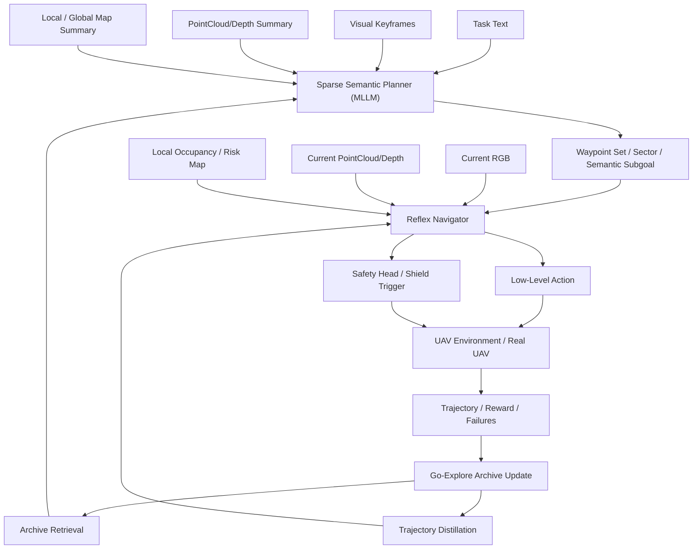

# Hierarchical Multimodal UAV Navigation Plan

## 1. 目标与定位

本文档用于将当前 `UAV-Flow` 项目中的端到端 UAV 控制链路，升级为一个更适合论文发表与真实部署的分层式多模态语义导航框架。

核心目标是：

- 让大模型只负责低频、稀疏调用的高层语义规划
- 让高频控制交给轻量、低延迟的反射式导航网络
- 用 Go-Explore archive 解决长航程、多岔路、稀疏奖励、难探索的问题
- 用多模态观测实现“语义理解”和“几何安全”解耦

这个方向相对当前 `OpenVLA-UAV` 的主要变化，不是简单替换一个模型，而是把单阶段“观测 -> 连续动作”重构成：

1. 语义战略规划
2. archive 记忆与探索
3. 蒸馏后的低层反射执行

---

## 2. 建议的问题表述

### 2.1 问题定义

给定自然语言任务描述与无人机的视觉-LiDAR点云多模态观测，目标是在长航程、障碍密集、稀疏奖励环境下，实现低 token 开销、低时延、可部署的语义导航。

### 2.2 建议题目

- `Hierarchical Multimodal UAV Navigation via Sparse LLM Waypointing and Archive Distillation`
- `Language-Guided Multimodal Aerial Navigation with Archive-Distilled Reflex Policy`
- `Embodied Multimodal Aerial Navigation via Sparse LLM Waypoint Reasoning and Reactive Control`

### 2.3 一句话摘要

我们让 MLLM 只执行低频高层航点推理，而将高频局部导航交由基于 Go-Explore archive 蒸馏得到的轻量反射策略完成，从而在长航程 UAV 语义导航中同时降低 token 成本、控制延迟与碰撞风险。

---

## 3. 方法总览

### 3.1 总体思想

不要让大模型直接输出连续控制，而是输出稀疏语义子目标或离散航点；不要让低层策略自己“盲探索”，而是结合 archive 中已验证的关键状态与轨迹；不要把视觉和 LiDAR 点云简单拼接，而是让视觉偏语义、点云偏几何与安全。

### 3.2 三层结构

当前工程基线中的点云建议优先采用“单视角深度反投影点云”实现，即从 UAV 当前相机深度图反投影出局部 `Nx3` 点集。这一实现可以提供接近空间物体局部重建的几何观测，但它仍然属于局部视角点云，而不是多帧融合后的全局稠密建图。

#### Layer 1. Sparse Semantic Planner

低频调用的大模型规划器。

输入：

- 任务文本
- 最近若干步关键帧视觉摘要
- 最近若干步 LiDAR 点云/深度摘要
- 局部占据图或局部拓扑图
- archive 检索到的相似历史情景摘要

输出：

- 主方向扇区
- 候选航点集合
- 子目标语义标签
- 规划置信度
- 是否触发重新规划

#### Layer 2. Goal-Conditioned Multimodal Archive

训练时用于高覆盖探索，测试时用于记忆检索辅助。

archive 不是只按几何位置存，而是按目标条件下的多模态 cell 存储：

`c_t = phi(rgb_t, pointcloud_t, goal_t, pose_t, map_t)`

每个 cell 至少存：

- 多模态状态摘要
- 到达该 cell 的轨迹片段
- 成功率
- 碰撞率
- 时间代价
- 能耗
- 剩余距离估计
- 语义匹配分数

#### Layer 3. Archive-Distilled Reflex Navigator

高频执行的轻量策略网络。

输入：

- 当前 RGB / depth / point cloud
- 当前局部航点
- 局部占据图 / 风险图

输出：

- 局部动作
- 或速度 / 偏航率
- 或离散宏动作

建议增加两个头：

- `action_head`
- `safety_head`

---

## 4. 框架图

---

## 5. 模块命名建议

为了增强论文辨识度，建议统一使用下面这组模块命名。

| 模块 | 建议名称 | 作用 |
| --- | --- | --- |
| 高层规划器 | `Sparse Semantic Planner (SSP)` | 稀疏调用的大模型航点规划 |
| archive 模块 | `Goal-Conditioned Multimodal Archive (GCMA)` | 目标条件下的多模态记忆与探索 |
| 检索器 | `Archive Retriever (AR)` | 从 archive 中找相似历史 cell |
| 低层执行器 | `Archive-Distilled Reflex Navigator (ADRN)` | 轻量、低延迟局部导航 |
| 安全控制 | `Safety Shield Head (SSH)` | 风险预测与紧急避障 |
| 重规划管理 | `Replan and Gating Module (RGM)` | 决定是否重规划、退回、切换候选航点 |

---

## 6. 航点与 archive 定义

### 6.1 航点表示

建议将航点定义为：

`w_t = (x, y, z, psi, r, s)`

其中：

- `(x, y, z)`：目标位置
- `psi`：期望朝向
- `r`：容忍半径
- `s`：语义阶段标签

### 6.2 cell 设计

建议 cell 定义为：

`c_t = phi(o_t_rgb, o_t_pc, g_t, p_t, h_t)`

其中：

- `o_t_rgb`：视觉嵌入
- `o_t_pc`：LiDAR点云或深度嵌入
- `g_t`：文本目标嵌入
- `p_t`：位置、朝向、高度、速度
- `h_t`：局部地图摘要

### 6.3 为什么不能只按坐标建 archive

如果只按几何位置建 archive，会产生语义别名问题：

- 场景结构相似，但目标语义不同
- 同一位置、不同朝向，可见目标完全不同
- 室外和半遮挡场景中，局部几何相同但视觉语义差异很大

因此 archive 至少需要包含：

- 几何局部图
- 视觉语义嵌入
- 文本目标嵌入
- 朝向
- 高度

---

## 7. 当前项目到新框架的映射

### 7.1 当前项目里的已有基础

当前仓库已经有三部分可以直接复用：

- 数据与 imitation 学习基础：
  - [uav_dataset.py](/E:/github/UAV-Flow/OpenVLA-UAV/prismatic/vla/datasets/uav_dataset.py)
  - [finetune_uav.py](/E:/github/UAV-Flow/OpenVLA-UAV/vla-scripts/finetune_uav.py)
- 当前的动作服务：
  - [openvla_act.py](/E:/github/UAV-Flow/OpenVLA-UAV/vla-scripts/openvla_act.py)
- 仿真执行与控制接口：
  - [batch_run_act_all.py](/E:/github/UAV-Flow/UAV-Flow-Eval/batch_run_act_all.py)
  - [uav_control_server.py](/E:/github/UAV-Flow/UAV-Flow-Eval/uav_control_server.py)
  - [uav_control_panel.py](/E:/github/UAV-Flow/UAV-Flow-Eval/uav_control_panel.py)

### 7.2 需要改造的关键方向

| 当前组件 | 当前角色 | 新框架中的改造方向 |
| --- | --- | --- |
| `openvla_act.py` | 直接输出下一步动作 | 改成稀疏航点/扇区/子目标规划器 |
| `batch_run_act_all.py` | 每步调用模型拿动作 | 改成低频规划 + 高频局部执行 |
| `uav_dataset.py` | 以一步动作监督为主 | 增加 waypoint-conditioned 局部轨迹样本 |
| `finetune_uav.py` | 微调 VLA 动作模型 | 增加 reflex navigator 训练脚本或分支 |
| `uav_control_server.py` | 手动控制和截图 | 可扩展为局部控制执行 backend |
| `uav_control_panel.py` | 手动控制 UI | 可作为数据采集与故障分析工具 |

---

## 8. 在当前模型上的修改计划

这一部分是最重要的工程落地计划，直接对应当前仓库。

### Phase 0. 统一当前动作表示

目标：先把当前“观测 -> 4D 连续动作”接口抽象清楚，为后续替换高层/低层模块做准备。

建议动作表示分成两层：

- 高层输出：
  - `sector_id`
  - `candidate_waypoints`
  - `semantic_subgoal`
  - `planner_confidence`
- 低层输出：
  - `forward_velocity`
  - `lateral_velocity`
  - `vertical_velocity`
  - `yaw_rate`
  - `safety_score`

建议新增文件：

- `OpenVLA-UAV/vla-scripts/plan_schema.py`
- `UAV-Flow-Eval/runtime_interfaces.py`

交付物：

- 统一 planner output schema
- 统一 low-level action schema

### Phase 1. 把 `openvla_act.py` 从动作预测改成航点规划

目标：让大模型只做低频规划，而不是每步控制。

建议修改：

- 当前 [openvla_act.py](/E:/github/UAV-Flow/OpenVLA-UAV/vla-scripts/openvla_act.py)
  - 输入保留：图像、文本、状态
  - 输出从 `[dx, dy, dz, dyaw]` 改为：
    - 离散方向扇区
    - 候选航点
    - 子目标标签
    - 置信度

建议新增文件：

- `OpenVLA-UAV/vla-scripts/openvla_waypoint_planner.py`

交付物：

- 一个新的 `/plan` 接口
- 支持每 `K` 步规划一次
- 返回结构化 waypoint JSON

### Phase 2. 构建 goal-conditioned multimodal archive

目标：让探索不再依赖盲搜，把关键局部状态记下来。

建议新增文件：

- `OpenVLA-UAV/prismatic/vla/datasets/archive_dataset.py`
- `OpenVLA-UAV/vla-scripts/build_multimodal_archive.py`
- `UAV-Flow-Eval/archive_runtime.py`

archive 记录内容：

- `cell_id`
- `rgb_embedding`
- `pointcloud_embedding`
- `goal_embedding`
- `pose`
- `map_summary`
- `traj_segment`
- `success_rate`
- `collision_rate`
- `time_cost`
- `energy_cost`
- `distance_to_goal_est`

交付物：

- 离线 archive 构建脚本
- 在线 archive 检索接口
- 相似历史情景召回能力

### Phase 3. 训练 archive-distilled reflex navigator

目标：把 archive 中高质量轨迹蒸馏成可 onboard 部署的轻量策略。

建议新增文件：

- `OpenVLA-UAV/vla-scripts/train_reflex_navigator.py`
- `OpenVLA-UAV/prismatic/vla/datasets/reflex_nav_dataset.py`
- `OpenVLA-UAV/prismatic/vla/models/reflex_nav_model.py`

训练数据来源：

- 当前 `UAV-Flow` 轨迹
- archive 回放的优质局部轨迹
- 手动控制采集轨迹

建议网络输入：

- 当前 RGB
- 当前 point cloud/depth
- 当前 local waypoint
- 局部风险图

建议网络输出：

- `action_head`
- `safety_head`

交付物：

- 轻量局部导航模型
- 局部碰撞风险预测

### Phase 4. 改造 `batch_run_act_all.py` 为分层执行器

目标：把当前每步请求动作，升级为“稀疏高层 + 高频低层”执行循环。

建议改造 [batch_run_act_all.py](/E:/github/UAV-Flow/UAV-Flow-Eval/batch_run_act_all.py)：

当前流程：

1. 取图
2. 调模型
3. 直接返回一步动作
4. 执行动作

新流程：

1. 初始化 archive 检索器
2. 每 `K` 步调用 planner
3. planner 输出候选航点
4. local navigator 按当前航点连续执行 `k_local` 步
5. safety head 实时判断是否触发 shield
6. 若进展停滞、风险过高、目标置信度下降，则触发 replan

建议新增文件：

- `UAV-Flow-Eval/hierarchical_eval.py`
- `UAV-Flow-Eval/safety_controller.py`
- `UAV-Flow-Eval/replan_manager.py`

交付物：

- 分层评测脚本
- 低频 planner 调用机制
- 中断/退回/重规划逻辑

### Phase 5. 扩展传感器与安全机制

目标：把多模态与真实部署问题提前纳入。

建议加入：

- point cloud / depth 摘要编码
- 模态 dropout
- 光照/天气随机化
- 风扰动
- 状态估计噪声
- 控制时延

建议新增文件：

- `UAV-Flow-Eval/sensor_fusion.py`
- `UAV-Flow-Eval/domain_randomization.py`

交付物：

- 面向 sim-to-real 的训练/评测配置
- 多模态缺失鲁棒性测试脚本

### Phase 6. 用现有手动控制链路做数据采集

当前新增的手动控制模块可以直接服务这个研究方向：

- [uav_control_server.py](/E:/github/UAV-Flow/UAV-Flow-Eval/uav_control_server.py)
- [uav_control_panel.py](/E:/github/UAV-Flow/UAV-Flow-Eval/uav_control_panel.py)

建议用途：

- 采集局部避障演示数据
- 采集航点跟随修正数据
- 记录失败场景截图和状态
- 收集“LLM 高层错了时低层如何补偿”的实例

建议新增采集字段：

- 当前任务文本
- 当前 planner 航点
- 当前 archive cell
- 当前动作标签
- 当前风险分数
- 是否触发 shield

---

## 9. 训练流程建议

### Stage A. archive 构建

1. 给定目标文本和环境
2. 用 exploration policy + planner 进行探索
3. 存储高价值 cell 和轨迹片段
4. 标注成功、失败、时间、碰撞、能耗

### Stage B. reflex navigator 蒸馏

监督来源：

- archive 中高质量局部轨迹
- 当前 `UAV-Flow` imitation 数据
- 手动控制采集数据

loss 设计建议：

- imitation loss
- progress loss
- collision penalty
- safety calibration loss
- control smoothness loss

### Stage C. replan/gating 训练

训练一个决策模块判断：

- 继续执行当前 waypoint
- 切换候选 waypoint
- 重新调用 planner
- 回退到 archive 中的上一个关键 cell

### Stage D. 联合微调

固定或半固定 planner，微调：

- reflex navigator
- safety head
- replan gating module

优化目标：

- success
- latency
- token cost
- safety

---

## 10. 实验设计

### 10.1 主实验

| 组别 | 方法 | 说明 |
| --- | --- | --- |
| A | End-to-end MLLM | 大模型直接输出动作 |
| B | Planner + Local Policy | 大模型出航点，低层普通策略跟随 |
| C | Archive-only | 无 LLM，仅 archive 和记忆探索 |
| D | Vision-only | 仅视觉输入 |
| E | Vision + PointCloud | 多模态输入 |
| F | Full Method | SSP + GCMA + ADRN + Safety + Replan |

### 10.2 指标

| 指标 | 说明 |
| --- | --- |
| Success Rate | 是否完成任务 |
| SPL / Soft-SPL | 路径效率 |
| Collision Rate | 碰撞率 |
| Navigation Time | 导航时间 |
| Path Length | 路径长度 |
| Energy | 能耗 |
| Replan Frequency | 重规划频率 |
| Token Cost | 大模型 token 消耗 |
| Decision Latency | 决策延迟 |
| Safety Trigger Count | shield 触发次数 |

### 10.3 消融实验

| 消融项 | 目的 |
| --- | --- |
| 去掉 archive | 验证记忆探索作用 |
| 去掉 archive retrieval | 验证检索而非普通 replay 的作用 |
| 去掉 distillation | 验证轻量执行器的重要性 |
| 去掉 point cloud | 验证几何安全模态作用 |
| 去掉 safety head | 验证安全机制 |
| 去掉 replan | 验证在线纠错 |
| 不同 sector granularity | 验证离散规划粒度 |
| 不同 LLM 调用频率 | 验证稀疏调用策略 |

### 10.4 泛化实验

| OOD 类型 | 说明 |
| --- | --- |
| Unseen Maps | 未见场景 |
| Unseen Objects | 未见目标类别 |
| Unseen Phrases | 未见文本表达 |
| Lighting / Weather Shift | 光照与天气变化 |
| Obstacle Density Shift | 障碍密度变化 |

### 10.5 archive 有效性分析

建议单独做一组图表：

- archive coverage growth
- cell diversity
- successful revisitation ratio
- from-cell-to-goal success probability
- distilled policy vs archive trajectory similarity
- token use vs navigation progress

---

## 11. 论文贡献建议写法

建议把贡献点固定成四条：

1. 提出一个面向 UAV 语义导航的分层多模态框架，将大模型限制在低频高层航点推理，显著降低 token 成本与在线决策延迟。
2. 提出一个目标条件下的多模态 archive，将视觉语义、LiDAR点云几何、文本目标和局部地图共同编码为记忆单元，用于高覆盖探索与历史情景检索。
3. 提出 archive-to-policy distillation 机制，将 archive 中高质量局部轨迹蒸馏为轻量反射式导航器，实现机载友好的高频局部控制。
4. 在仿真与真实部署设置下验证该方法在成功率、泛化性、安全性和部署效率上的综合优势。

---

## 12. 最值得优先推进的开发顺序

如果只按“最短路径出结果”的原则，建议按下面顺序推进：

1. 先把 planner output 从动作改成航点
2. 先在 `UAV-Flow-Eval` 里跑通低频 planner + 高频 local policy 的执行循环
3. 再做 archive 构建与检索
4. 再训练 reflex navigator
5. 最后补 safety / replan / sim-to-real 扰动

---

## 13. 最小可行版本

最小可行版本不要一开始就全上。

第一版建议只做：

- 输入：RGB + 文本
- planner：每 `K` 步输出离散扇区或单航点
- local executor：简单轻量网络或规则控制器
- archive：只存视觉嵌入 + 目标嵌入 + pose
- 评测：success / collision / token / latency

只要这一版跑通，就已经能支撑第一轮实验和方法故事。

---

## 14. 立即可执行的代码任务清单

### 任务 A. 规划接口改造

- 新建 `openvla_waypoint_planner.py`
- 保留当前服务化接口风格
- 输出 JSON 航点结构

### 任务 B. 评测循环改造

- 在 `UAV-Flow-Eval` 新建 `hierarchical_eval.py`
- 增加 `plan_every_k_steps`
- 增加 `replan` 触发条件

### 任务 C. archive 原型

- 新建 `build_multimodal_archive.py`
- 支持从当前数据集和运行轨迹构建 cell

### 任务 D. reflex navigator 原型

- 新建 `train_reflex_navigator.py`
- 先用 imitation 训练

### 任务 E. 手动采集增强

- 在 `uav_control_server.py` 中增加 richer logging
- 在 `uav_control_panel.py` 中增加轨迹保存与标签按钮

---

## 15. 结论

这个方向不是“在当前 OpenVLA-UAV 上再加一个 LLM 模块”，而是要把当前单阶段动作预测系统升级成：

- 稀疏语义规划
- 记忆辅助探索
- 蒸馏式低层反射控制

它的价值不只在性能，更在于：

- 更低 token 成本
- 更低时延
- 更强可部署性
- 更强的长航程探索能力
- 更清晰的多模态角色分工

从当前仓库出发，最自然的切入点是：

1. 先改造 `openvla_act.py` 的输出形式
2. 再改造 `batch_run_act_all.py` 的执行循环
3. 接着引入 archive 与 reflex navigator

这条路线既能保留你们现有代码资产，也最容易逐步积累论文结果。
