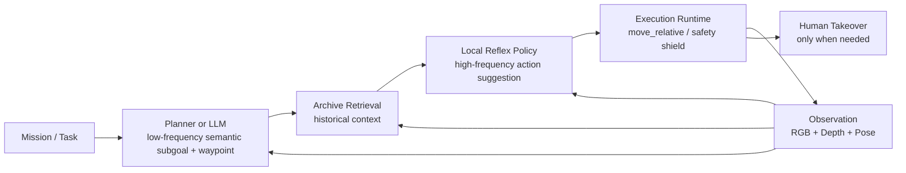

# Phase 4 Entry Plan

## Positioning

Phase 4 is the transition from:
- "manual collection + offline reflex validation"

to:
- "planner/LLM low-frequency guidance + local reflex high-frequency execution + human supervisory takeover only"

The core idea is:
- high-level intent should come from the planner or LLM
- low-level control should come from the local reflex policy
- humans should no longer be the primary motion source

## What We Keep

We keep the current layered structure:
- `uav_control_server.py` as the execution runtime
- planner as low-frequency semantic guidance
- archive as memory/retrieval context
- reflex policy as high-frequency action inference
- capture / replay / evaluation as the data flywheel

## What Changes In Phase 4

### Human Role Reduction

Humans should gradually stop doing:
- repeated `W/A/S/D/R/F/Q/E` action driving as the main control source
- repeated manual `Request Plan` / `Request Reflex` as the default runtime path
- manually stitching together subgoals during routine episodes

Humans should mainly do:
- mission setup
- safety takeover
- anomaly labeling
- evaluation and acceptance

### New Automatic Loop

The target runtime loop becomes:

## LLM Responsibility

LLM should only own the high-level layer:
- interpret mission/task text
- choose semantic subgoal
- choose replan timing
- propose candidate waypoints or sectors

LLM should not directly own:
- per-frame motor actions
- per-step yaw micro-control
- high-frequency obstacle avoidance

Those should remain in the local reflex layer or safety layer.

## Phase 4 Subplans

### 4.1 Autonomous Reflex Executor

Goal:
- let the server optionally execute reflex-suggested actions automatically

Target:
- add an `auto_execute_reflex` mode
- keep manual mode and hybrid mode
- support action gating by confidence / risk / safety rules

Initial progress:
- `0%`

### 4.2 Takeover And Intervention Logging

Goal:
- record when humans intervene, why, and what corrective action was taken

Target:
- log takeover start/end
- log intervention reason
- save before/after runtime state

Initial progress:
- `0%`

### 4.3 LLM / Planner Mission Guidance Adapter

Goal:
- let planner/LLM become the normal source of semantic intent

Target:
- define mission input schema
- define semantic subgoal output schema
- keep planner cadence sparse and explainable

Initial progress:
- `0%`

### 4.4 Safety Shield And Execution Gating

Goal:
- prevent autonomous low-level execution from causing obviously unsafe actions

Target:
- confidence threshold gate
- risk threshold gate
- forbidden action overrides near obstacles
- forced hold / hover fallback

Initial progress:
- `0%`

### 4.5 Online Evaluation And Acceptance Loop

Goal:
- evaluate autonomous runtime without relying on ad hoc observation only

Target:
- use `online_reflex_eval.py`
- add automatic session summaries
- track switch rate / confidence / waypoint improvement / takeover count

Initial progress:
- `0%`

### 4.6 Dataset Flywheel For Semi-Autonomous Episodes

Goal:
- make online autonomous runs feed back into training cleanly

Target:
- distinguish:
  - autonomous success samples
  - autonomous failure samples
  - takeover-corrected samples
- retrain on accepted runs only

Initial progress:
- `0%`

## Deliverables

Phase 4 should produce:
- autonomous reflex execution mode
- takeover logging
- mission-level planner/LLM guidance path
- safety-gated autonomous runtime
- online evaluation reports
- semi-autonomous training dataset pipeline

## Exit Criteria

Phase 4 can be considered basically complete when:
- planner/LLM provides semantic guidance without human motion micromanagement
- reflex policy executes low-level actions automatically for routine episodes
- human role is mostly supervisory takeover
- safety gates prevent clearly unsafe execution
- online evaluation shows stable autonomous behavior
- retraining uses autonomous episode data instead of mostly manual keyboard control

## Immediate Next Step

Start with `4.1 Autonomous Reflex Executor`, because it is the smallest step that truly reduces human action-driving and turns the current system from "assisted manual control" into "semi-autonomous execution".
