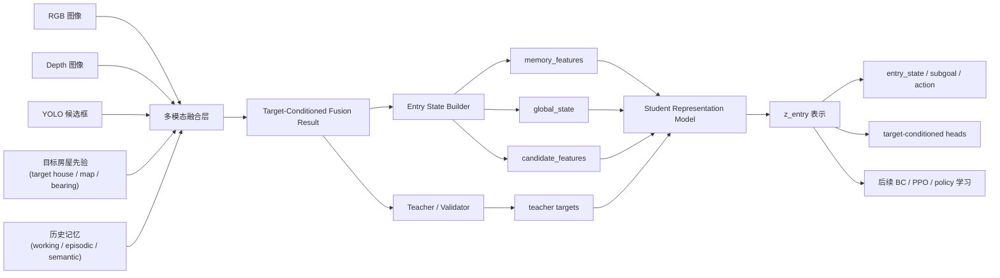

# 28. 记忆架构图与模型说明

## 1. 为什么要加入记忆

当前任务不是单帧图像分类，而是一个连续的、多模态的、目标条件约束下的入口搜索过程。  
UAV 在真实执行时需要同时回答这些问题：

1. 当前看到的是不是目标房屋相关区域
2. 这扇门是不是目标房屋入口
3. 这块区域是不是已经看过很多次却没有新收益
4. 上一次最可靠的候选入口是不是还值得继续跟踪
5. 当前应该继续靠近、换边搜索、还是放弃当前候选

因此，单帧 `RGB + Depth + YOLO + Fusion` 只能回答“这一帧看到了什么”，  
而不能完整回答“之前看过什么、试过什么、下一步为什么要这样做”。

这也是我们引入三层记忆的根本原因：

- `Working Memory`
- `Episodic Memory`
- `Semantic Memory`

## 2. 总体架构

## 3. 三层记忆怎么分工

### 3.1 Working Memory

作用：
- 存最近几步最重要的短时上下文
- 解决“刚刚看了哪里、刚刚选了哪个候选、刚刚执行了什么动作”

当前最适合放：
- 最近 `top-K` 候选摘要
- 最近一次 `best entry`
- 最近动作
- 最近 target-conditioned 子目标
- 当前帧对应的 `memory_guidance / memory_decision_guidance`

特点：
- 时效短
- 更新快
- 对动作层最有帮助

### 3.2 Episodic Memory

作用：
- 存“在哪里看过什么”的历史快照
- 解决“我以前在这个 house 的这个视角看过什么”

当前最适合放：
- 关键 `viewpoint snapshot`
- 对应 `rgb / depth_preview / fusion_overlay`
- `pose / yaw / sector`
- 当时的融合结果

特点：
- 更像可回放的历史片段
- 更适合 LLM / 人工审核 / 后续检索式增强

### 3.3 Semantic Memory

作用：
- 存聚合后的稳定知识
- 解决“这栋房屋哪些 sector 看过、哪些候选门已经确认 blocked / rejected / non-target”

当前最适合放：
- `entry_search_status`
- `searched_sectors`
- `candidate_entries`
- `last_best_entry_id`
- 每个候选的 `status / attempt_count`

特点：
- 最稳定
- 最适合直接参与 fusion 决策
- 也是当前训练阶段最值得优先使用的 memory

## 4. 我们当前模型里，记忆具体怎么进入

当前链路已经不是“只把 memory 记录下来”，而是已经分两层介入：

### 4.1 候选排序层

在 [fusion_entry_analysis.py](/E:/github/UAV-Flow/phase2_multimodal_fusion_analysis/fusion_entry_analysis.py) 中，记忆会直接改变候选分数：

1. 历史被拒绝过的相似候选降权  
2. 重复低收益 sector 的弱候选降权  
3. `last_best_entry` 对应候选跟踪加权

这一步主要影响：
- `candidate_total_score`
- `candidate_target_match_score`
- 候选排序稳定性

### 4.2 高层决策层

记忆还会继续影响更高层的 `target-conditioned` 决策：

1. 连续低收益 sector 不再反复空看  
2. 持续 blocked 的入口不再死盯  
3. 动作会被改成“转向新 sector 继续搜索”

这一步主要影响：
- `target_conditioned_subgoal`
- `target_conditioned_action_hint`
- `memory_decision_guidance`

## 5. 训练时，记忆数据怎样呈现

训练阶段不直接把整份 memory JSON 原样喂给模型，  
而是先压成结构化 `memory_features`。

当前已经导出的轻量特征包括：

- `observed_sector_count`
- `entry_search_status`
- `candidate_entry_count`
- `approachable_entry_count`
- `blocked_entry_count`
- `rejected_entry_count`
- `current_sector_id`
- `current_sector_observation_count`
- `current_sector_low_yield_flag`
- `current_sector_best_target_match_score`
- `last_best_entry_exists`
- `last_best_entry_status`
- `last_best_entry_attempt_count`
- `previous_action`
- `previous_subgoal`
- `episodic_snapshot_count`
- `memory_source`

这些特征已经从：
- [entry_state_builder.py](/E:/github/UAV-Flow/phase2_multimodal_fusion_analysis/entry_state_builder.py)
- [distillation_dataset_export.py](/E:/github/UAV-Flow/phase2_multimodal_fusion_analysis/distillation_dataset_export.py)

导入到：
- [feature_builder.py](/E:/github/UAV-Flow/phase2_5_representation_distillation/feature_builder.py)

并被拼接进 `global_features`。

## 6. 当前模型结构应该怎么理解

可以把当前 student 理解成一个“带记忆增强的入口表示模型”。

输入分三块：

1. `global_features`
   - UAV 当前姿态
   - 目标房屋相对信息
   - 前障碍状态
   - memory 摘要

2. `candidate_features`
   - top-K 门窗候选
   - RGB/YOLO 语义
   - depth 几何
   - target-conditioned 匹配分数

3. `teacher targets`
   - 普通监督
   - target-conditioned 监督

模型先学一个紧凑表示 `z_entry`，再输出：

- `entry_state`
- `subgoal`
- `action_hint`
- `target_conditioned_state`
- `target_conditioned_subgoal`
- `target_conditioned_action_hint`
- `target_conditioned_target_candidate_id`

## 7. 为什么当前先把 memory 接进 global branch

这是一个有意的工程选择。

原因：

1. 改动最小  
2. 不会推翻现有 `v1/v2/v3/v4` 训练结构  
3. 先验证 memory 是否带来收益  
4. 后面如果需要，再把 memory 升级成独立 branch

也就是说，当前是：

`global_state + memory_features`

而不是一开始就做：

`global branch + candidate branch + memory branch + retrieval branch`

这是为了先稳住训练，再逐步加复杂度。

## 8. 当前架构的优势

当前这版架构最适合你的原因是：

1. 它是多模态的  
2. 它是 target-conditioned 的  
3. 它有连续搜索记忆  
4. 它既能做工程落地，也能支撑论文方法表述

一句话概括：

**我们的方法不是简单的图像分类器，而是一个融合 RGB / Depth / YOLO / Target Prior / Memory 的目标房屋入口搜索表示模型。**

## 9. 当前架构的限制

这点也要说清楚，后面写论文和做实验都会用到：

1. 目前 memory 主要以 `semantic_memory` 为主  
2. `working_memory` 还是轻量摘要，不是完整时序序列  
3. `episodic_memory` 还没有正式进入 student 训练，只是保留了接口  
4. 目前 memory 先拼到 `global_features`，还不是独立分支

所以当前版本更准确地说是：

**Memory-Aware Representation Distillation V1**

而不是完整的“检索式长时记忆 Transformer”。

## 10. 对论文写法的建议

如果后面写方法图，我建议你用下面这套表述：

- 底层：
  - `RGB + YOLO + Depth Geometry`
- 中层：
  - `Target-Conditioned Multimodal Fusion`
- 记忆层：
  - `Working / Episodic / Semantic Memory`
- 学习层：
  - `Memory-Aware Distilled Entry Representation`
- 决策层：
  - `Target-conditioned subgoal and action prediction`

这样既不会夸大，也能把你的创新点讲得很完整。

