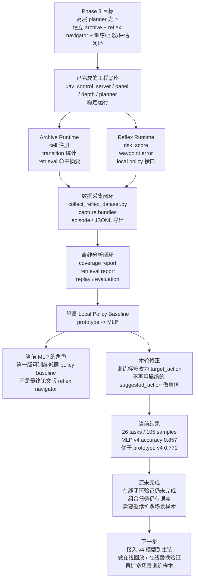

# UAV 阶段进展记录

本文档用于记录每个阶段已经完成的工作、当前状态、下一阶段目标。

- 当前更新时间：2026-03-17
- 记录方式：每完成一个阶段，就在本文档中追加一节
- 关联文档：
  - `docs/uav_phase_upgrade_roadmap.md`
  - `docs/hierarchical_multimodal_uav_plan.md`

---

## Phase 1 已完成：单机控制与深度可观测基线

### 阶段目标

建立一个可重复使用的 UAV 控制底座，先把“环境启动 + 无人机控制 + 主视角 + 深度图 + 数据保存”这条链路打通，并收成适合提交到仓库的版本。

### 本阶段完成内容

#### 1. `UAV-Flow-Eval/uav_control_server.py`

已完成：

- 保留 Unreal 环境启动能力
- 保留单机 UAV 控制能力
- 保留主视角 RGB 画面接口
- 保留深度图接口和深度原图输出
- 保留状态接口
- 保留截图与采集接口
- 保留 `task label` 和 `plan` 基础接口
- 保留单 UAV 可见、额外内部 agent 隐藏逻辑

当前主要接口：

- `GET /state`
- `GET /frame`
- `GET /depth_frame`
- `GET /depth_raw.png`
- `GET /camera_info`
- `GET /plan`
- `POST /move_relative`
- `POST /capture`
- `POST /task`
- `POST /plan`
- `POST /request_plan`
- `POST /runtime_debug`
- `POST /shutdown`

#### 2. `UAV-Flow-Eval/uav_control_panel.py`

已完成：

- 保留主视角窗口
- 保留深度图窗口
- 保留键盘控制和按钮控制
- 保留截图按钮
- 保留 `task label`
- 保留 `request plan`
- 删除点云、mapping、额外地图窗口逻辑

当前键位：

- `W/S/A/D`：前后左右
- `R/F`：上升下降
- `Q/E`：偏航旋转
- `C`：截图
- `V`：刷新主视角和深度图
- `P`：请求高层规划

#### 3. 深度链路

已完成：

- 深度图预览渲染
- 深度原始 16-bit PNG 输出
- `camera_info` 生成
- RGB + depth + depth preview + camera_info 的本地保存

#### 4. 上传前清理

已完成：

- 将主控制链路中的 pointcloud / radar / mapping 代码从 `uav_control_server.py` 与 `uav_control_panel.py` 中移除
- 保留深度图作为当前主传感器链路
- 保留最小可运行、可维护、可提交版本

### 本阶段交付物

- 可运行的 UAV 控制服务
- 可运行的远程控制面板
- 主视角 + 深度图双窗口
- 可保存的 RGB/depth 数据包

### 本阶段验收结论

当前 Phase 1 可以视为完成，形成了后续阶段继续扩展的稳定底座。

---

## Phase 2 进行中：稀疏高层规划替代逐步动作预测

### 阶段目标

把系统从“逐步动作控制”升级成“低频高层规划 + 高频底层执行”。

核心原则：

- 大模型或 planner 不再每一步都输出动作
- `uav_control_server.py` 继续只做执行器
- 规划结果以结构化方式表达，而不是连续控制量

### Phase 2 计划完成内容

#### 1. 统一高层规划输出格式

规划器输出不再是：

- `[dx, dy, dz, dyaw]`

而改成：

- `semantic_subgoal`
- `sector_id`
- `candidate_waypoints`
- `planner_confidence`
- `should_replan`

#### 2. 保持 `uav_control_server.py` 为执行器

本阶段要求：

- server 不负责复杂语义推理
- server 只负责：
  - 接收 planner 结果
  - 存储当前 `plan state`
  - 按当前 waypoint/子目标执行
  - 回传状态和调试信息

#### 3. 外部 planner 服务接入

计划新增：

- 一个独立 planner 服务或脚本

作用：

- 输入：RGB、深度摘要、位姿、任务文本
- 输出：结构化高层规划结果

建议优先实现两种模式：

- `heuristic fallback planner`
- `external planner service`

#### 4. 控制面板增加 planner 调试信息

面板中需要稳定显示：

- 当前子目标
- 当前扇区编号
- 置信度
- 当前第一个 waypoint

#### 5. 稀疏调用机制

需要增加：

- 每 `K` 步或满足条件时再调用一次 planner
- 执行过程中默认沿当前规划继续走
- 支持后续扩展为 `replan trigger`

### Phase 2 子计划拆分与达成度

#### 子计划 2.1：定义统一 planner 协议

目标：

- 固定 planner 的请求和响应 schema
- 让 `server / panel / 外部 planner` 三端使用同一套结构

主要任务：

- 定义 planner request 字段
- 定义 planner response 字段
- 固定 waypoint 数据结构
- 固定 `semantic_subgoal / sector_id / confidence / should_replan` 等字段语义

当前达成度：

- `90%`

当前状态：

- 已完成协议初版，后续若引入更强 planner 只需在现有 schema 上扩展

#### 子计划 2.2：实现本地 fallback planner

目标：

- 在没有外部 planner 服务时，系统仍然能输出结构化高层计划
- 保证第二阶段可以先闭环跑起来

主要任务：

- 基于当前位姿生成启发式 waypoint
- 生成默认 `semantic_subgoal`
- 生成默认 `sector_id`
- 生成默认 `planner_confidence`

当前达成度：

- `100%`

当前状态：

- 已完成基础 fallback planner，可在外部 planner 不可用时输出结构化 plan

#### 子计划 2.3：接入独立 external planner 服务

目标：

- 将高层规划从 `uav_control_server.py` 中解耦出去
- 使 server 只承担执行器角色

主要任务：

- 新建独立 planner 脚本或服务
- 接收 RGB、深度摘要、位姿、任务标签
- 返回结构化 `plan`
- 明确 planner 超时与失败回退机制

当前达成度：

- `100%`

当前状态：

- 已新增独立 `planner_server.py`，当前为启发式外部 planner，后续可替换为模型版 planner

#### 子计划 2.4：补齐 server 侧计划执行状态

目标：

- 让 `uav_control_server.py` 能稳定维护当前 plan state
- 为后续 waypoint 执行与 replan 打基础

主要任务：

- 明确 `current_plan` 更新逻辑
- 明确 `request_plan` 触发逻辑
- 在 `/state` 中稳定暴露 planner 状态
- 为后续加入 `plan progress` / `current waypoint index` 预留字段

当前达成度：

- `65%`

当前状态：

- 已在 server 中加入 `current_plan`、`planner_runtime`、`last_plan_request` 等运行时状态

#### 子计划 2.5：补齐 panel 侧 planner 调试显示

目标：

- 让面板能清楚展示当前高层规划结果
- 让用户在调试时直接看到 planner 是否正常工作

主要任务：

- 显示 `semantic_subgoal`
- 显示 `sector_id`
- 显示 `planner_confidence`
- 显示第一个 `candidate_waypoint`
- 显示 planner 请求成功/失败状态

当前达成度：

- `70%`

当前状态：

- 已在 panel 中显示 planner 名称、子目标、扇区、置信度、waypoint、planner 状态与延迟

#### 子计划 2.6：实现稀疏调用与阶段验收闭环

目标：

- 验证“低频高层规划 + 高频底层执行”这条链路可以真正运行

主要任务：

- 定义 planner 调用步长 `K`
- 明确何时沿当前 plan 执行
- 明确何时请求新 plan
- 跑通一轮基础闭环测试
- 记录 planner 调用频率与时延

当前达成度：

- `80%`

当前状态：

- 已支持 `k_step` 自动规划模式，server 可按步数自动触发 planner；当前剩余工作主要是更系统的闭环验证与参数调优

### Phase 2 具体开发清单

#### A. planner 输入输出协议

需要明确：

- 请求字段
  - `task_label`
  - `frame_id`
  - `timestamp`
  - `pose`
  - `depth`
  - `camera_info`
  - `image_b64`
- 响应字段
  - `plan_id`
  - `planner_name`
  - `generated_at`
  - `semantic_subgoal`
  - `sector_id`
  - `candidate_waypoints`
  - `planner_confidence`
  - `should_replan`
  - `debug`

#### B. waypoint 表达

本阶段建议固定使用：

- `x`
- `y`
- `z`
- `yaw`
- `radius`
- `semantic_label`

#### C. server 侧逻辑

本阶段要做：

- 明确 `request_plan` 的触发逻辑
- 明确 fallback planner 和 external planner 的切换逻辑
- 明确 `current_plan` 的更新时机
- 为下一阶段预留 waypoint 执行状态

#### D. panel 侧逻辑

本阶段要做：

- 让 `request plan` 变成稳定调试入口
- 将 `plan` 显示得更清楚
- 让用户能明显看到：
  - 当前计划是什么
  - 当前是否在重规划
  - planner 是否成功响应

### Phase 2 交付物

目标交付：

- 一个结构化 planner 接口
- 一个可独立运行的 planner 服务或脚本
- 一个稳定的 fallback planner
- 控制面板中的 planner 调试显示
- 基于“稀疏规划”的基础闭环

### Phase 2 验收标准

完成标准：

- planner 输出不再是逐步动作，而是结构化计划
- `uav_control_server.py` 不承担高层语义推理
- `uav_control_panel.py` 能稳定显示 planner 状态
- 系统能跑“每 K 步规划一次，其余时间按当前 plan 执行”的闭环

### Phase 2 当前轮验收结果

验收时间：

- `2026-03-18`

验收结论：

- 当前工程版 `Phase 2` 验收通过

本轮验收已确认：

- 外部 planner 模式通过
- fallback planner 模式通过
- `k_step` 自动规划模式通过
- panel 中 planner 状态显示通过
- capture 中 `plan / depth / camera_info / runtime_debug` 写入通过

关键证据摘要：

- 外部 planner 模式下，panel 显示：
  - `planner=external_heuristic_planner`
  - `status=ok`
  - `source=external`
- fallback 模式下，panel 显示：
  - `planner=heuristic_fallback`
  - `status=fallback`
  - `source=local_heuristic`
- 自动规划模式下，控制服务日志出现：
  - `Auto planner triggered at step=196 ...`
  - `Auto planner triggered at step=201 ...`
- panel 中显示：
  - `trigger=step_interval`
  - `auto=k_step`
  - `next=...`

当前建议：

- 可以将当前工程线视为 `Phase 2` 已完成
- 下一步建议进入 `Phase 3`

关联验收文档：

- `docs/phase2_acceptance_report.md`

---

## Phase 3 进行中：archive runtime 与 reflex 执行接口打底

### 阶段目标

在不破坏当前 `主视角 + 深度图 + planner` 稳定链路的前提下，先把 Phase 3 的第一批运行时能力补起来：

- 引入可在线记录的 goal-conditioned archive runtime
- 开始填充 `archive_cell_id / local_policy_action / risk_score`
- 让 `server / panel / capture metadata` 都能观察到 archive 状态
- 为后续 reflex navigator 和 archive 检索打下统一运行时接口

### Phase 3 第一批子计划拆分与达成度

#### 子计划 3.1：定义 archive cell schema 与量化规则

目标：

- 把 archive 从“概念”变成可运行的数据结构
- 固定 cell 的基本组成方式，避免后续 server/panel/capture 各写一套

主要任务：

- 定义 `task_label + semantic_subgoal + quantized pose + depth signature` 的 cell 结构
- 固定 `cell_id` 生成规则
- 固定最近访问列表与基础 transition 统计

当前达成度：

- `100%`

当前状态：

- 已新增 `UAV-Flow-Eval/archive_runtime.py`
- 已完成首版 cell schema、pose bin、depth signature、transition 计数与 recent cells 管理

#### 子计划 3.2：接入 server 侧 archive 注册与状态暴露

目标：

- 让 `uav_control_server.py` 在运行时自动登记当前 cell
- 让 `/state` 和独立调试接口可以直接看到 archive 状态

主要任务：

- 在 observation refresh / move / plan update / task update 时同步 archive
- 在 `/state` 中暴露 `archive`
- 增加独立 `GET /archive` 接口

当前达成度：

- `85%`

当前状态：

- server 已接入 `ArchiveRuntime`
- 已能在 `/state` 中返回 `archive.current_cell_id / cell_count / transition_count / top_cells`
- 已新增 `GET /archive`
- 后续还需要补更明确的 archive retrieval / progress 指标

#### 子计划 3.3：补齐 panel 侧 archive 调试显示

目标：

- 让控制面板在 Phase 3 里不仅能看 planner，也能看 archive 当前状态
- 让后续 archive/reflex 调试不必只盯日志

主要任务：

- 新增 archive 状态栏
- 显示当前 `archive_cell_id`
- 显示访问次数、cell 总数、transition 数量、近期 cell 摘要

当前达成度：

- `80%`

当前状态：

- panel 已新增 `Archive ...` 状态行
- 已显示 `cell / visits / cells / transitions / recent / hint`
- 后续还可以继续加 retrieval candidates 与 archive 命中来源说明

#### 子计划 3.4：加入基础 risk 估计与 reflex 占位接口

目标：

- 在真正训练 reflex navigator 之前，先把运行时需要的风险位和低层动作位打通
- 给后续 safety / local policy 留出统一接口

主要任务：

- 基于深度图中心区域生成 heuristic `risk_score`
- 更新 `runtime_debug.risk_score`
- 维持 `runtime_debug.local_policy_action`
- 保留 `shield_triggered` 作为后续安全头占位

当前达成度：

- `70%`

当前状态：

- `local_policy_action` 已在移动时稳定更新
- 已新增基于深度中心区域的 heuristic `risk_score`
- 已开始更新 `shield_triggered`
- 当前仍是 debug 级 heuristic，尚未真正影响控制决策

#### 子计划 3.5：扩展 capture metadata 为 archive-aware 数据包

目标：

- 让当前手动采集链路开始记录 archive 相关信息
- 为后续离线 archive 构建和 reflex 数据集准备字段

主要任务：

- 在 capture metadata 中加入 `archive`
- 保留 `plan + runtime_debug + archive` 一起写入 bundle

当前达成度：

- `75%`

当前状态：

- capture bundle 已开始写入 `archive`
- 返回给 panel 的 capture 结果中也会带上 `archive`
- 后续还需要补“成功/失败局部轨迹标签”等更适合训练的数据字段

### Phase 3 第二批子计划拆分与达成度

#### 子计划 3.6：补齐 archive retrieval 输出与命中状态

目标：

- 不只是“记录 cell”，还要能给出当前最相关的历史 cell 候选
- 为后续 planner / reflex 共享 archive 检索结果打基础

主要任务：

- 为 retrieval candidate 增加显式 score
- 在 archive state 中暴露 `active_retrieval`
- 保持 `planner context / state / panel` 使用一致的 retrieval 结果

当前达成度：

- `75%`

当前状态：

- archive runtime 已新增 `retrieval_score`
- 已开始暴露 `active_retrieval`
- 后续还需要补更细的命中原因、成功率和轨迹片段摘要

#### 子计划 3.7：建立 reflex runtime interface

目标：

- 在真实 reflex navigator 训练前，先固定运行时接口
- 让 server 能给出“当前建议动作 / 航点误差 / 风险 / retrieval 命中”的统一状态

主要任务：

- 新增 `reflex_runtime` 结构
- 计算 `waypoint_distance / yaw_error / vertical_error / progress`
- 给出 heuristic `suggested_action`
- 暴露独立 `GET /reflex` 接口

当前达成度：

- `80%`

当前状态：

- server 已新增 `reflex_runtime`
- 已开始根据 waypoint 和 risk 生成 heuristic `suggested_action`
- 已新增 `GET /reflex`
- 当前仍是 heuristic stub，尚未接入真实蒸馏策略

#### 子计划 3.8：panel 侧补齐 retrieval / reflex 可视化

目标：

- 让控制面板能直接看见 archive 命中与 reflex 建议动作
- 降低后续 Phase 3 联调时只靠日志排查的成本

主要任务：

- 新增 reflex 状态栏
- 显示建议动作、航点距离、yaw 误差、progress
- 显示 retrieval 命中的 cell 摘要

当前达成度：

- `75%`

当前状态：

- panel 已新增 `Reflex ...` 状态行
- 已开始显示 `suggested / wp_dist / yaw_err / progress / retrieval`
- 后续可以再补动作来源、命中 score 和 shield 触发提示

### Phase 3 当前轮已落地代码

- `UAV-Flow-Eval/archive_runtime.py`
  - 新增 Phase 3 archive runtime 骨架
- `UAV-Flow-Eval/uav_control_server.py`
  - 接入 archive runtime
  - 新增 `GET /archive`
  - 在 `/state` 与 `capture` 中写入 archive 状态
  - 加入基于深度图的 heuristic `risk_score`
- `UAV-Flow-Eval/uav_control_panel.py`
  - 新增 archive 调试显示行
  - 新增 reflex 调试显示行

### Phase 3 第二批补充代码

- `UAV-Flow-Eval/archive_runtime.py`
  - retrieval candidate 已开始附带 `retrieval_score`
  - archive state 已开始暴露 `active_retrieval`
- `UAV-Flow-Eval/uav_control_server.py`
  - 已新增 `reflex_runtime`
  - 已新增 `GET /reflex`
  - planner request context 已开始带 `archive + reflex_runtime`
- `UAV-Flow-Eval/uav_control_panel.py`
  - 已显示 retrieval 命中与 reflex 建议动作摘要

### Phase 3 第三批子计划拆分与达成度

#### 子计划 3.9：建立 external reflex policy 协议

目标：

- 让 reflex navigator 像 planner 一样，可以被独立服务替换
- 避免后续接轻量策略模型时再改主控制链路

主要任务：

- 定义 `phase3.reflex_request.v1`
- 定义标准化 `reflex_runtime` 输出
- 保证 external policy 与 local heuristic 使用同一 schema

当前达成度：

- `85%`

当前状态：

- 已在 `runtime_interfaces.py` 中新增 reflex request / runtime payload helper
- 已新增 `UAV-Flow-Eval/reflex_policy_server.py`
- 当前 external reflex service 还是 heuristic stub，后续可直接替换成模型版服务

#### 子计划 3.10：在 server 中接入 external reflex policy + fallback

目标：

- 让 `uav_control_server.py` 可以优先请求外部 local policy
- 外部服务异常时回退到本地 heuristic reflex，不影响实验链路

主要任务：

- 新增 `--reflex_policy_url / --reflex_policy_endpoint`
- 新增 `POST /request_reflex`
- 支持 `reflex_auto_mode=on_move`
- 保持 external 结果优先，本地 heuristic 只兜底

当前达成度：

- `80%`

当前状态：

- server 已支持 external reflex policy URL
- 已新增 `POST /request_reflex` 和 `GET /reflex`
- 已支持 `reflex_auto_mode=on_move`
- 已处理 “state refresh 覆盖 external reflex” 的运行时问题

#### 子计划 3.11：panel 侧补齐 external reflex 调试入口

目标：

- 让面板能直接验证 external reflex 是否工作
- 降低后续联调 local policy 服务的摩擦

主要任务：

- 新增 `Request Reflex` 入口
- 显示 `policy / source / latency / should_execute`
- 在 UI 中保留当前 heuristic 与 external 结果的统一显示方式

当前达成度：

- `75%`

当前状态：

- panel 已新增 `Request Reflex`
- 已显示 `policy / source / lat / exec`
- 后续还可以继续补 policy error 状态与最近一次请求结果摘要

### Phase 3 第四批子计划拆分与达成度

#### 子计划 3.12：扩展 capture 为 reflex 训练样本

目标：

- 让当前 capture bundle 不只是“调试快照”，而开始具备训练样本的结构
- 让后续 reflex dataset 构建先复用现有手动链路

主要任务：

- 固定 `phase3.capture_bundle.v1`
- 在 bundle 中新增 `reflex_sample`
- 将 waypoint / risk / retrieval / suggested_action 一起写入

当前达成度：

- `80%`

当前状态：

- capture bundle 已新增 `dataset_schema_version`
- 已新增 `reflex_sample`
- 已用真实样本 `capture_20260318_151608_bundle.json` 验证：
  - `dataset_schema_version=phase3.capture_bundle.v1`
  - 已写入 `archive / reflex_runtime / reflex_sample`
  - `reflex_sample` 中已包含非默认 `suggested_action / retrieval_cell_id / waypoint_distance_cm`
- 后续还需要补更明确的成功/失败标签与 episode-level 统计

#### 子计划 3.13：新增离线 reflex replay / summary 脚本

目标：

- 在不连接 Unreal 的前提下，也能检查当前采集数据是否适合 reflex 学习
- 为后续数据集分析和回放验证提供轻量入口

主要任务：

- 读取 `*_bundle.json`
- 输出 chronological replay lines
- 汇总 suggested action / risk / waypoint distance / retrieval 命中统计
- 支持按 task 过滤和导出 JSON

当前达成度：

- `100%`

当前状态：

- 已新增 `UAV-Flow-Eval/reflex_replay.py`
- 已支持 bundle 目录扫描、回放摘要、统计导出
- 已用真实采样目录 `captures_remote` 验证：
  - `reflex_replay.py` 能正确读出 2026-03-18 新样本
  - 回放结果已出现非默认 `suggested_action=yaw_right`
  - 回放结果已出现非默认 `retrieval_cell_id`
- 当前为离线汇总版，后续可继续扩成 episode replay / visualization

#### 子计划 3.14：补强 external reflex 调试入口

目标：

- 让 external reflex service 的联调链路更完整
- 让 panel 可直接验证 external/local heuristic 的切换结果

主要任务：

- `Request Reflex` 手动触发
- UI 中显示 `source / policy / latency / should_execute`
- 保持自动 `on_move` 和手动请求共存

当前达成度：

- `100%`

当前状态：

- panel 已支持 `Request Reflex`
- reflex 状态栏已显示 `source / policy / latency / exec`
- server 已保留 external 优先、本地 heuristic fallback 的运行策略
- 已通过真实联调验证：
  - `Auto reflex policy updated ... source=external`
  - capture 时 external reflex 状态可正确写入 bundle

### Phase 3 第三批补充代码

- `UAV-Flow-Eval/runtime_interfaces.py`
  - 已新增 `build_reflex_request`
  - 已新增 `coerce_reflex_runtime_payload`
- `UAV-Flow-Eval/reflex_policy_server.py`
  - 已新增独立 external reflex policy stub 服务
- `UAV-Flow-Eval/uav_control_server.py`
  - 已支持 external reflex policy + fallback
  - 已新增 `POST /request_reflex`
  - 已支持 `reflex_auto_mode=on_move`
- `UAV-Flow-Eval/uav_control_panel.py`
  - 已新增 `Request Reflex` 手动入口
  - 已显示 `source / policy / latency / exec`

### Phase 3 第四批补充代码

- `UAV-Flow-Eval/runtime_interfaces.py`
  - 已新增 `build_reflex_sample`
- `UAV-Flow-Eval/uav_control_server.py`
  - capture bundle 已新增 `dataset_schema_version`
  - capture bundle 已新增 `reflex_sample`
- `UAV-Flow-Eval/reflex_replay.py`
  - 已新增离线 replay / summary 脚本
- `UAV-Flow-Eval/uav_control_panel.py`
  - 已补强 external reflex 的手动触发与状态显示

### Phase 3 第五批子计划拆分与达成度

#### 子计划 3.15：建立 episode 级数据组织与 manifest 导出

目标：

- 让当前 capture 样本不再只是零散文件，而能按任务和时间自动整理成 episode
- 为后续训练、回放和误差分析提供稳定的 episode 入口

主要任务：

- 按 `task_label + 时间间隔` 自动分组 episode
- 为每个 episode 生成 manifest
- 输出全局 `episode_index.json`

当前达成度：

- `100%`

当前状态：

- 已新增 `UAV-Flow-Eval/reflex_dataset_builder.py`
- 已支持从 `captures_remote` 自动生成：
  - `phase3_dataset_export/episode_index.json`
  - `phase3_dataset_export/episodes/<episode_id>/episode_manifest.json`
- 已用真实样本验证当前可正确生成 `episode_0001_move_right_3_meters`

#### 子计划 3.16：导出训练友好的 reflex dataset JSONL

目标：

- 让现有 capture bundle 可直接导出成训练/离线分析更容易消费的平铺样本格式
- 减少后续 local policy 训练前的数据清洗成本

主要任务：

- 从 bundle 中提取 `pose / waypoint / retrieval / risk / action`
- 生成统一 `phase3.dataset_sample.v1`
- 输出全局 `reflex_dataset.jsonl`

当前达成度：

- `100%`

当前状态：

- `reflex_dataset_builder.py` 已支持导出 `phase3.dataset_sample.v1`
- 已生成：
  - `phase3_dataset_export/reflex_dataset.jsonl`
- 当前样本中已包含：
  - `executed_action`
  - `suggested_action`
  - `retrieval_cell_id`
  - `waypoint_distance_cm`
  - `risk_score`
- 后续可继续扩展为图像拷贝、分片存储或 episode-level tensor 导出

#### 子计划 3.17：新增 retrieval 质量统计报告

目标：

- 用结构化指标判断 archive retrieval 是否真的提供了目标相关的帮助
- 为后续从 heuristic stub 切到真实 local policy 前提供可比指标

主要任务：

- 统计 retrieval hit rate
- 统计 same-task / same-subgoal 命中率
- 统计 retrieval score / visit count / risk 对比
- 支持按 task 过滤导出 JSON

当前达成度：

- `100%`

当前状态：

- 已新增 `UAV-Flow-Eval/retrieval_quality_report.py`
- 已用真实样本验证输出：
  - `retrieval_hit_rate=1.0`
  - `same_task_hit_rate=1.0`
  - `same_subgoal_hit_rate=1.0`
  - `avg_retrieval_score=4.29175`

### Phase 3 第六批子计划拆分与达成度

#### 子计划 3.18：定义可训练 local policy artifact 格式

目标：

- 让当前 external reflex service 不再只能跑 heuristic stub
- 先建立一个稳定的“训练产物 -> 服务加载 -> runtime 推理”接口

主要任务：

- 固定 `phase3.reflex_policy_artifact.v1`
- 定义 feature names / means / stds / action prototypes
- 保证 artifact 能被独立服务直接加载

当前达成度：

- `100%`

当前状态：

- 已新增 `UAV-Flow-Eval/reflex_policy_model.py`
- 已固定 artifact schema：
  - `feature_names`
  - `feature_means`
  - `feature_stds`
  - `actions.<action>.prototype`
- 已生成真实 artifact：
  - `phase3_dataset_export/prototype_reflex_policy.json`

#### 子计划 3.19：新增 local policy 训练脚本骨架

目标：

- 让当前 Phase 3 JSONL 数据可以直接产出一个可加载的 local policy 模型文件
- 先跑通训练闭环，再逐步替换成真实神经网络训练

主要任务：

- 读取 `reflex_dataset.jsonl`
- 提取固定 feature 向量
- 训练 prototype-based local policy
- 输出 artifact JSON

当前达成度：

- `100%`

当前状态：

- 已新增 `UAV-Flow-Eval/train_reflex_policy.py`
- 已用真实数据验证训练输出：
  - `phase3_dataset_export/prototype_reflex_policy.json`
- 当前训练器为 prototype baseline，后续可替换为 MLP / Transformer / diffusion local policy

#### 子计划 3.20：让 reflex policy server 支持加载真实 artifact

目标：

- 让 `reflex_policy_server.py` 既能跑 heuristic stub，也能跑训练得到的 local policy artifact
- 保持主控制链路不变，只替换 policy server 即可

主要任务：

- 新增 `--model_artifact`
- 优先走 artifact 推理，保留 heuristic fallback
- 在 `/health` 和 `/schema` 中暴露当前 policy mode

当前达成度：

- `100%`

当前状态：

- `UAV-Flow-Eval/reflex_policy_server.py` 已支持 `--model_artifact`
- 已支持 `prototype_model` 模式
- 已用本地 smoke test 验证：
  - artifact 可被成功加载
  - runtime 输出可返回 `suggested_action=yaw_right`
- 已完成主链联调验证：
  - `uav_control_server.py` 启动时已出现 `Startup reflex policy synced ... source=external_model`
  - panel 中已显示：
    - `mode=prototype_policy`
    - `policy=prototype_reflex_policy`
    - `source=external_model`

### 当前结论

- Phase 3 第一批运行时骨架已开始落地
- 当前系统已经从“planner-only debug”升级为“planner + archive runtime + risk debug + reflex service-ready”基础形态
- 当前已经开始具备“可采集、可回放、可替换 local policy”的工程条件
- 当前已经开始具备“可组织成 episode、可导出训练 JSONL、可评估 retrieval 质量”的离线数据基础
- 当前已经开始具备“可训练 baseline local policy artifact、可由 policy server 直接加载”的最小训练闭环
- 还没有进入真正的神经网络 reflex navigator 训练与执行闭环

### Phase 3 当前轮验收结果（第四批）

验收结论：

- `通过`

本轮验收范围：

- 子计划 `3.12`：capture bundle 是否已经具备 reflex 训练样本结构
- 子计划 `3.13`：离线 replay / summary 是否已经能正确读取真实样本
- 子计划 `3.14`：external reflex 调试入口与运行时状态是否已经打通

本轮验收证据：

- 真实样本：
  - `captures_remote/capture_20260318_151608_bundle.json`
  - `captures_remote/capture_20260318_151608_camera_info.json`
- bundle 中已存在：
  - `dataset_schema_version=phase3.capture_bundle.v1`
  - `archive`
  - `reflex_runtime`
  - `reflex_sample`
- `reflex_sample` 中已出现非默认运行时字段：
  - `suggested_action=yaw_right`
  - `retrieval_cell_id=move_right_3_meters__turn_right__x5_y1_z0_yaw4__fd1`
  - `waypoint_distance_cm=205.625`
- `reflex_replay.py --capture_dir captures_remote --limit 5` 已能正确读出新样本：
  - `suggest=yaw_right`
  - `retrieval=move_right_3_meters__turn_right__x5_y1_z0_yaw4__fd1`
- 运行日志已出现：
  - `Auto reflex policy updated at step=... source=external suggested=yaw_right`
  - `Captured RGB/depth bundle: ...capture_20260318_151608_bundle.json`

当前判断：

- Phase 3 第四批的数据采集、离线回放和 external reflex 调试链路已经验通
- 可以进入 Phase 3 下一批：episode 级数据组织、retrieval 质量统计、真实 local policy 替换

### Phase 3 当前轮验收结果（第六批）

验收结论：

- `通过`

本轮验收范围：

- 子计划 `3.18`：可训练 local policy artifact 格式是否已经固定
- 子计划 `3.19`：训练脚本是否已经能从现有 JSONL 产出可加载 artifact
- 子计划 `3.20`：模型版 reflex policy 是否已经接入主控制链路

本轮验收证据：

- 训练输出：
  - `phase3_dataset_export/prototype_reflex_policy.json`
- 训练命令已成功运行：
  - `train_reflex_policy.py --dataset_jsonl ... --output_path ...`
- reflex 服务已成功加载 artifact：
  - `Loaded reflex model artifact ... policy_name=prototype_reflex_policy samples=1`
- 主服务启动日志已出现：
  - `Startup reflex policy synced policy=prototype_reflex_policy source=external_model suggested=yaw_right`
- panel 已显示模型版 reflex 状态：
  - `mode=prototype_policy`
  - `policy=prototype_reflex_policy`
  - `source=external_model`

当前判断：

- Phase 3 第六批已经完成从“离线数据集”到“可加载的 local policy artifact”再到“主链运行时接入”的最小闭环
- 当前 prototype baseline 已经不再只是独立脚本，而是能通过 `reflex_policy_server.py` 驱动 `uav_control_server.py`

### Phase 3 第七批子计划拆分与达成度

#### 子计划 3.21：新增多任务 / 多动作自动化采集脚本

目标：

- 让 Phase 3 不再只依赖零散的手动点按采样
- 用可复现的任务套件快速扩充多任务、多动作覆盖

主要任务：

- 新增 `collect_reflex_dataset.py`
- 内置 `basic / extended` 两套任务序列
- 支持 `Set Task -> Request Plan -> Move -> Request Reflex -> Capture` 的自动化执行
- 支持 dry-run 预览本轮会覆盖哪些任务和动作

当前达成度：

- `100%`

当前状态：

- 已新增 `UAV-Flow-Eval/collect_reflex_dataset.py`
- 已支持：
  - `--suite basic|extended`
  - `--capture_mode each_step|task_end|none`
  - `--request_plan_per_task`
  - `--request_reflex_each_step`
- 已用 dry-run 验证 `extended` 套件会覆盖：
  - `15` 个任务
  - `forward=21`
  - `backward=5`
  - `left=9`
  - `right=9`
  - `up=5`
  - `down=5`
  - `yaw_left=8`
  - `yaw_right=8`

#### 子计划 3.22：新增多任务 / 多动作覆盖报告

目标：

- 用结构化报告判断当前数据集的动作覆盖和任务覆盖是否足够训练 local policy
- 为下一轮采集直接提供“缺什么动作、缺多少样本”的建议

主要任务：

- 新增 `reflex_coverage_report.py`
- 统计任务数、动作数、task-action 覆盖矩阵
- 标记全局缺失动作和每任务缺失动作
- 输出下一轮补采建议

当前达成度：

- `100%`

当前状态：

- 已新增 `UAV-Flow-Eval/reflex_coverage_report.py`
- 已用当前真实数据验证输出：
  - `sample_count=1`
  - `unique_task_count=1`
  - 当前只覆盖 `up`
  - 缺失 `forward/backward/left/right/down/yaw_left/yaw_right`
- 已能直接输出下一轮补采建议

#### 子计划 3.23：把 prototype baseline 升级成真实轻量 local policy 网络

目标：

- 不再只依赖 prototype nearest-neighbor baseline
- 引入真正可训练的轻量网络，用作 Phase 3 的第一个神经网络 local policy baseline

主要任务：

- 在 `reflex_policy_model.py` 中新增轻量 `MLP classifier`
- 让 `train_reflex_policy.py` 支持 `prototype | mlp`
- 让 `reflex_policy_server.py` 继续沿用同一 artifact 加载路径

当前达成度：

- `100%`

当前状态：

- `UAV-Flow-Eval/reflex_policy_model.py` 已支持：
  - `prototype`
  - `mlp_classifier`
- `UAV-Flow-Eval/train_reflex_policy.py` 已支持 `--model_type mlp`
- 已生成真实 MLP artifact：
  - `phase3_dataset_export/mlp_reflex_policy.json`
- 已用当前数据验证训练输出：
  - `model_type=mlp_classifier`
  - `train_accuracy=1.0`
  - `final_loss=0.0015662903625685463`

#### 子计划 3.24：建立 Phase 3 的训练 / 回放 / 评估闭环

目标：

- 让 Phase 3 从“可采样 + 可训练”进一步升级为“可评估 + 可比较 baseline”
- 形成后续替换更强 local policy 网络时的标准离线评估入口

主要任务：

- 新增 `evaluate_reflex_policy.py`
- 支持 artifact 在 dataset JSONL 上离线评估
- 输出 `action_accuracy / should_execute_accuracy / per-task accuracy / confusion`
- 保持与现有 `reflex_replay.py` 和 `reflex_dataset_builder.py` 兼容

当前达成度：

- `100%`

当前状态：

- 已新增 `UAV-Flow-Eval/evaluate_reflex_policy.py`
- 已用当前数据验证：
  - `action_accuracy=1.0`
  - `should_execute_accuracy=1.0`
  - `avg_confidence=1.0`
- 已做 MLP runtime smoke test：
  - `mlp_policy mlp_reflex_policy external_model yaw_right 1.0`

### Phase 3 当前轮验收结果（第七批）

验收结论：

- `通过（离线闭环）`

本轮验收范围：

- 子计划 `3.21`：多任务 / 多动作采集脚本是否已经可用
- 子计划 `3.22`：覆盖报告是否已经能指出当前数据缺口
- 子计划 `3.23`：轻量 MLP local policy 是否已经能训练出 artifact
- 子计划 `3.24`：是否已经形成训练 / 回放 / 评估闭环

本轮验收证据：

- `collect_reflex_dataset.py --dry_run --suite extended` 已输出：
  - `task_count=15`
  - `executed_action_counts={forward:21, backward:5, left:9, right:9, up:5, down:5, yaw_left:8, yaw_right:8}`
- `train_reflex_policy.py --model_type mlp` 已成功生成：
  - `phase3_dataset_export/mlp_reflex_policy.json`
- `evaluate_reflex_policy.py` 已成功输出：
  - `action_accuracy=1.0`
  - `should_execute_accuracy=1.0`
  - `avg_confidence=1.0`
- `reflex_coverage_report.py` 已明确指出当前真实数据仍然覆盖不足：
  - 仅有 `1` 个任务
  - 当前只覆盖 `up`
  - 缺少大部分平移与偏航动作
- MLP artifact 已可进入统一 runtime 推理路径：
  - `mlp_policy mlp_reflex_policy external_model yaw_right 1.0`

当前判断：

- Phase 3 第七批已经把“多任务采集计划、覆盖诊断、轻量神经网络 baseline、离线评估”都接进了当前工程链
- 当前 Phase 3 已经具备离线训练 / 回放 / 评估闭环
- 当前还没有完成的不是代码链路，而是真实数据量与动作覆盖仍明显不足

### 下一步建议

- 下一批优先真正运行 `collect_reflex_dataset.py` 做一轮 `extended` 套件采集
- 再重新执行：
  - `reflex_dataset_builder.py`
  - `reflex_coverage_report.py`
  - `train_reflex_policy.py --model_type mlp`
  - `evaluate_reflex_policy.py`
- 然后开始比较：
  - `prototype` vs `mlp`
  - 不同任务子集
  - 不同动作覆盖度下的离线效果变化

---

## 后续记录模板

后续每个阶段建议按以下格式追加：

### Phase N 已完成：阶段名称

#### 阶段目标

#### 本阶段完成内容

#### 本阶段交付物

#### 本阶段验收结论

---

## Phase 3 当前轮验收结果（第八批）

验收结论：
- `通过（监督口径修正后）`

本轮修正重点：
- 将 Phase 3 的训练与评估监督标签从 `suggested_action` 切换为 `target_action`
- `target_action` 统一由 `executed_action` 归一化生成
- 保留 `suggested_action` 作为 teacher/debug 字段，但不再作为 local policy 的训练真值

本轮落地内容：
- `UAV-Flow-Eval/reflex_dataset_builder.py`
  - 新增 `target_action`
  - 新增 `executed_action_canonical`
  - 新增 `teacher_action`
- `UAV-Flow-Eval/reflex_policy_model.py`
  - 新增统一动作归一化函数
  - prototype / mlp 训练统一改为使用 `target_action`
- `UAV-Flow-Eval/evaluate_reflex_policy.py`
  - 离线评估统一改为对齐 `target_action`
- `UAV-Flow-Eval/reflex_coverage_report.py`
  - 新增 `target_action_counts`
  - 明确区分 `executed_action / target_action / suggested_action`

本轮使用的真实数据：
- `phase3_dataset_export/reflex_dataset.jsonl`
- `phase3_dataset_export/episode_index.json`
- 当前导出结果：
  - `episode_count=16`
  - `sample_count=71`
  - `unique_task_count=15`

本轮关键统计：
- `target_action_counts`
  - `forward=21`
  - `backward=5`
  - `left=9`
  - `right=9`
  - `up=6`
  - `down=5`
  - `yaw_left=8`
  - `yaw_right=8`
- `suggested_action_counts`
  - `yaw_right=71`

这说明：
- 当前数据采集链已经成功覆盖多任务、多动作执行
- 当前弱模型 teacher 仍然高度塌缩到 `yaw_right`
- 但训练标签已经不再被 teacher 带偏，离线训练闭环语义已经纠正

本轮训练与评估结果：
- prototype baseline
  - artifact: `phase3_dataset_export/prototype_reflex_policy_v2.json`
  - `action_accuracy=0.5492957746478874`
  - `avg_confidence=0.3417735971094118`
- mlp baseline
  - artifact: `phase3_dataset_export/mlp_reflex_policy_v2.json`
  - `action_accuracy=0.704225352112676`
  - `avg_confidence=0.47818709301276946`

当前判断：
- 这轮修正后，Phase 3 已经从“伪高精度的 teacher 自循环”修正为“基于真实执行动作的有效离线监督”
- 当前 `mlp_reflex_policy_v2` 已经可以视为比 `prototype_reflex_policy_v2` 更合理的第一版轻量 local policy baseline
- 当前离线闭环已经成立：
  - 自动采集
  - episode / JSONL 导出
  - 覆盖诊断
  - local policy 训练
  - local policy 评估

当前仍需继续补强的点：
- 动作覆盖仍未达到 `target_per_action=12`
  - `backward += 7`
  - `left += 3`
  - `right += 3`
  - `up += 6`
  - `down += 7`
  - `yaw_left += 4`
  - `yaw_right += 4`
- 当前 `move forward and descend` 子任务离线准确率仍为 `0.0`
- `backward / left / down` 等动作的 recall 仍然偏低，说明下一轮仍需补采并继续训练

下一步建议：
- 继续跑一轮 `collect_reflex_dataset.py --suite extended`
- 重点补采 `backward / down / yaw_left / yaw_right`
- 用新增样本重新执行：
  - `reflex_dataset_builder.py`
  - `reflex_coverage_report.py`
  - `train_reflex_policy.py --model_type mlp`
  - `evaluate_reflex_policy.py`
- 当动作覆盖更均衡后，再进入 Phase 3 的在线回放 / 在线策略替换验证

### Phase 3 当前轮验收结果（第九批）

验收结论：
- `通过（定向补采工具 + baseline 对比工具）`

本轮新增目标：
- 不再只依赖人工判断“下一轮该补采什么动作”
- 让系统能根据当前数据集覆盖缺口，直接生成定向补采任务
- 让 `prototype` 与 `mlp` 的差异不再只看单次 eval 输出，而是形成统一对比报告

本轮落地内容：
- `UAV-Flow-Eval/collect_reflex_dataset.py`
  - 新增 `--suite weak_actions`
  - 新增 `--coverage_dataset_jsonl`
  - 新增 `--coverage_target_per_action`
  - 新增 `--coverage_extra_per_action`
- `UAV-Flow-Eval/compare_reflex_policies.py`
  - 新增多 artifact 同数据集对比评估工具
  - 支持输出 `ranking + pairwise delta + per_action_recall_delta + per_task_accuracy_delta`

本轮关键验证：
- `collect_reflex_dataset.py --suite weak_actions --coverage_target_per_action 12 --dry_run`
  - 已根据当前真实数据自动生成 `11` 个补采任务
  - 计划补采动作数：
    - `backward=7`
    - `left=3`
    - `right=3`
    - `up=6`
    - `down=7`
    - `yaw_left=4`
    - `yaw_right=4`
- `compare_reflex_policies.py`
  - 已成功比较：
    - `prototype_reflex_policy_v2`
    - `mlp_reflex_policy_v2`
  - 当前对比结果：
    - `action_accuracy_delta = +0.15492957746478864`
    - `avg_confidence_delta = +0.13641349590335766`

当前判断：
- Phase 3 现在已经不只是“能采、能训、能评”，而是开始具备“按缺口自动补采、按结果自动比较 baseline”的能力
- 这让下一轮迭代会更像真正的实验闭环，而不是手动试错

下一步建议：
- 先运行一轮：
  - `collect_reflex_dataset.py --suite weak_actions`
- 然后重新执行：
  - `reflex_dataset_builder.py`
  - `reflex_coverage_report.py`
  - `train_reflex_policy.py --model_type mlp`
  - `compare_reflex_policies.py`
- 当 `weak_actions` 补采后，再判断是否需要进入在线 policy 替换验证

### Phase 3 当前轮验收结果（第十批）

验收结论：
- `通过（定向补采已执行，覆盖达标，完成补采后重训与比较）`

本轮实际执行结果：
- 已运行：
  - `collect_reflex_dataset.py --suite weak_actions`
- 实际新增采样：
  - `capture_count=34`
- 实际补采动作数：
  - `backward=7`
  - `left=3`
  - `right=3`
  - `up=6`
  - `down=7`
  - `yaw_left=4`
  - `yaw_right=4`

补采后的数据状态：
- `sample_count=105`
- `unique_task_count=26`
- `target_action_counts`
  - `forward=21`
  - `backward=12`
  - `left=12`
  - `right=12`
  - `up=12`
  - `down=12`
  - `yaw_left=12`
  - `yaw_right=12`
- `low_coverage_actions = {}`
- 当前覆盖结论：
  - `Coverage looks healthy for the configured target_per_action threshold.`

补采后重训产物：
- `phase3_dataset_export/prototype_reflex_policy_v3.json`
- `phase3_dataset_export/mlp_reflex_policy_v3.json`

补采后重训比较结果：
- prototype v3
  - `action_accuracy=0.5714285714285714`
  - `avg_confidence=0.3206384826850657`
- mlp v3
  - `action_accuracy=0.5619047619047619`
  - `avg_confidence=0.48566095985117413`

本轮关键判断：
- 定向补采本身是成功的，Phase 3 数据覆盖现在已经达标
- 但在补采后重训场景下，`MLP v3` 没有继续保持对 `prototype` 的领先
- 当前结果反而是：
  - `prototype v3` 在 `action_accuracy` 上略高
  - `mlp v3` 在 `avg_confidence` 上更高

这说明：
- 当前 MLP 路径没有偏离方向，但它还不是稳定优于 prototype 的版本
- 现阶段更合理的表述是：
  - `prototype` 仍然是当前更稳的强 baseline
  - `MLP` 是已经接通、但仍需继续调参与扩特征的神经网络 baseline

下一步建议：
- 在不改主链结构的前提下，继续做两类优化：
  - 调 MLP 训练配置：`hidden_dim / epochs / learning_rate / weight_decay`
  - 扩输入特征：增加更稳定的局部几何与 planner/archive 上下文特征
- 在下一轮对比里，目标不再只是“能训练”，而是“MLP 稳定超过 prototype”

### Phase 3 当前状态图

图示说明：
- `Archive Runtime` 和 `Reflex Runtime` 是 Phase 3 的主线能力，不是额外分支。
- `MLP` 当前只是把“可训练 low-level policy”这件事先落地成一个真实 baseline。
- 当前方向没有偏离，但还没有到最终论文版多模态 reflex navigator。

### Phase 3 当前轮验收结果（第十一批）

验收结论：
- `通过（弱动作补采已达标，v4 MLP 已重新领先 prototype）`

本轮新增工作：
- 为 `MLP` 增加了更丰富的局部几何与 planner/archive 上下文特征。
- 新增了 `sweep_reflex_mlp.py`，对 `hidden_dim / learning_rate / weight_decay / class_weight_power` 做小规模搜索。
- 重新训练并导出了：
  - `phase3_dataset_export/prototype_reflex_policy_v4.json`
  - `phase3_dataset_export/mlp_reflex_policy_v4.json`

本轮实际采样与覆盖结果：
- 已执行：
  - `collect_reflex_dataset.py --suite weak_actions`
- 新增补采：
  - `capture_count=34`
- 当前数据规模：
  - `sample_count=105`
  - `unique_task_count=26`
- 当前 `target_action_counts`
  - `forward=21`
  - `backward=12`
  - `left=12`
  - `right=12`
  - `up=12`
  - `down=12`
  - `yaw_left=12`
  - `yaw_right=12`
- 覆盖结论：
  - `low_coverage_actions = {}`
  - `Coverage looks healthy for the configured target_per_action threshold.`

本轮调参搜索最优结果：
- 最优配置：
  - `hidden_dim=64`
  - `learning_rate=0.02`
  - `weight_decay=0.0`
  - `class_weight_power=0.5`
- 验证集最优：
  - `val_action_accuracy=0.6923076923076923`
  - `val_avg_confidence=0.6820569966677172`

v4 模型离线比较结果：
- prototype v4
  - `action_accuracy=0.7714285714285715`
  - `avg_confidence=0.278598693535325`
- mlp v4
  - `action_accuracy=0.8571428571428571`
  - `avg_confidence=0.703121772818446`
- pairwise delta（mlp v4 - prototype v4）
  - `action_accuracy_delta=0.08571428571428563`
  - `avg_confidence_delta=0.424523079283121`

当前关键判断：
- `weak_actions` 定向补采已经把动作覆盖补齐，数据集现在符合当前阶段的训练实验要求。
- 经扩特征与调参后，`MLP v4` 已经重新超过 `prototype v4`，说明神经网络路径没有偏离方向，且开始体现出比规则原型更强的上限。
- 当前 Phase 3 的主问题已经从“能不能训练”转成“如何做在线闭环验证，以及如何继续扩多场景泛化”。

下一步建议：
- 先将 `mlp_reflex_policy_v4.json` 接入 `reflex_policy_server.py` 做主链在线验证。
- 重点观察：
  - 在线 `Reflex` 是否稳定为 `source=external_model`
  - 组合任务中 `forward / left / right / yaw` 切换是否自然
- 在线验证通过后，再扩新的场景与组合任务，继续拉高 `MLP` 的泛化能力。

### Phase 3 当前轮验收结果（第十二批）

验收结论：
- `通过（v4 模型主链在线接入通过，在线行为质量进入持续观察阶段）`

本轮在线验证配置：
- `reflex_policy_server.py`
  - `--model_artifact=phase3_dataset_export/mlp_reflex_policy_v4.json`
  - `--policy_name=mlp_reflex_policy_v4`
- `uav_control_server.py`
  - `--reflex_policy_url=http://127.0.0.1:5022`
  - `--reflex_auto_mode=on_move`

本轮在线验证证据：
- `uav_control_server.py` 日志稳定出现：
  - `Auto reflex policy updated ... policy=mlp_reflex_policy_v4 source=external_model`
- panel 在线状态显示：
  - `Reflex mode=mlp_policy`
  - `policy=mlp_reflex_policy_v4`
  - `source=external_model`
- 本轮在线任务样例：
  - `task_label=move right 3 meters`
  - `planner=external_heuristic_planner`
  - `subgoal=turn_right`
  - `archive retrieval` 已命中对应 `move_right_3_meters / turn_right` cell
- 本轮在线采样已落盘：
  - `captures_remote/capture_20260319_095408_bundle.json`

在线表现观察：
- 当前在线 reflex 建议已不再塌缩成单一动作，而是会随状态在：
  - `left`
  - `yaw_left`
  - `forward`
  之间变化。
- 这说明 `MLP v4` 在在线链路里已经真正参与决策，而不是只返回固定占位动作。
- 结合当前 waypoint 与 archive 命中状态，`left / forward / yaw_left` 的切换在几何上并非明显失真，说明模型已经具备一定的局部纠偏能力。

当前仍需继续观察的问题：
- panel 当前案例里 `conf=0.00`，与离线评估时的较高平均置信度不完全一致。
- 对于 `move right 3 meters` 这类“横移 + 转向”混合任务，在线建议还存在来回切换，需要继续收集更多在线样本来判断：
  - 是真实几何纠偏
  - 还是策略仍有抖动

本轮阶段判断：
- Phase 3 现在已经正式进入：
  - `离线训练可比较`
  - `在线主链可接入`
  - `在线行为可观察`
  的阶段。
- 当前的主问题已经不是“能不能接起来”，而是“怎样把在线行为稳定性做得更好”。

下一步建议：
- 增加一轮“在线回放/在线评估记录”，专门统计：
  - 建议动作切换频率
  - 置信度分布
  - 任务完成前的 waypoint 误差变化
- 在此基础上，再决定是：
  - 继续扩充 `move right / strafe / turn` 场景数据
  - 还是先修正 `confidence` 在线显示与校准

### Phase 3 当前轮进展（第十三批）

当前状态：
- `已完成工具交付，待运行在线评估 session`

本轮新增内容：
- 新增在线评估记录脚本：
  - `UAV-Flow-Eval/online_reflex_eval.py`
- 该工具会持续读取 `GET /state`，输出：
  - `summary.json`
  - `trace.jsonl`

当前支持的在线指标：
- 动作切换统计
  - `suggested_action_counts`
  - `action_switch_count`
  - `action_switch_rate_per_transition`
  - `switch_by_subgoal`
- 策略与链路状态统计
  - `policy_mode_counts`
  - `policy_name_counts`
  - `source_counts`
  - `retrieval_hit_rate`
- 置信度与运行时统计
  - `confidence_stats`
  - `latency_stats_ms`
  - `risk_stats`
  - `zero_confidence_fraction`
- waypoint 与几何误差统计
  - `waypoint_distance_stats_cm`
  - `yaw_error_abs_stats_deg`
  - `progress_stats_cm`

脚本运行方式：
- 主链运行时，执行：
  - `python E:\github\UAV-Flow\UAV-Flow-Eval\online_reflex_eval.py --server_url http://127.0.0.1:5020 --session_name phase3_online_eval --duration_s 45 --poll_interval_s 0.5 --only_on_change`
- 如果当前 reflex 是 `manual` 刷新模式，也可以执行：
  - `python E:\github\UAV-Flow\UAV-Flow-Eval\online_reflex_eval.py --server_url http://127.0.0.1:5020 --session_name phase3_online_eval --duration_s 45 --poll_interval_s 0.5 --only_on_change --request_reflex_on_poll`

本轮验证结果：
- `online_reflex_eval.py` 已通过：
  - `py_compile`
  - `--help`
- 当前尚未写入真实在线 session 结果，因此本批次记录为：
  - `工具已交付`
  - `在线 session 待验收`

下一步建议：
- 直接对 `mlp_reflex_policy_v4` 跑一轮 `online_reflex_eval.py`
- 本轮重点观察：
  - `action_switch_rate_per_transition`
  - `confidence_stats`
  - `waypoint_distance_stats_cm.improvement_initial_minus_final`
- 如果在线切换频率过高，再决定是否做：
  - 输出平滑
  - 置信度阈值门控
  - 组合任务补采

### Phase 4 入口计划

当前状态：
- `已建立正式入口计划，Phase 4 尚未开工`

计划文档：
- `docs/phase4_entry_plan.md`

Phase 4 的核心方向：
- `planner / LLM` 负责低频语义指导
- `local reflex policy` 负责高频低层动作
- 人从“主控制者”逐步退到“监督接管者”

Phase 4 的首要任务：
- `4.1 Autonomous Reflex Executor`
- 也就是先让当前 reflex policy 从“只给建议”走到“可选自动执行”

Phase 4 当前子计划与达成度：
- `4.1 Autonomous Reflex Executor`
  - 目标：加入可切换的 reflex 自动执行模式
  - 达成度：`40%`
- `4.2 Takeover And Intervention Logging`
  - 目标：记录人工接管时机、原因与纠正动作
  - 达成度：`0%`
- `4.3 LLM / Planner Mission Guidance Adapter`
  - 目标：将语义任务正式收入口径稳定的高层指导接口
  - 达成度：`0%`
- `4.4 Safety Shield And Execution Gating`
  - 目标：用置信度、风险和规则门控保护自动执行
  - 达成度：`0%`
- `4.5 Online Evaluation And Acceptance Loop`
  - 目标：把在线 summary 变成正式验收机制
  - 达成度：`0%`
- `4.6 Dataset Flywheel For Semi-Autonomous Episodes`
  - 目标：让半自动 episode 成为主要训练来源
  - 达成度：`0%`

下一步建议：
- 直接从 `4.1 Autonomous Reflex Executor` 开始
- 这是最小但最关键的一步，因为它决定我们是否真的从“人工驱动实验”进入“半自动闭环”

### Phase 4 当前轮进展（第一批）

当前状态：
- `已完成 4.1 的第一版执行链，待做真实在线验收`

本轮新增内容：
- `uav_control_server.py`
  - 新增 `--reflex_execute_mode {manual,assist_step}`
  - 新增 `--reflex_execute_confidence_threshold`
  - 新增 `--reflex_execute_max_risk`
  - 新增 `--reflex_execute_allow_heuristic`
  - 新增 `POST /execute_reflex`
  - 新增 `GET /reflex_execution`
- `uav_control_panel.py`
  - 新增 `Execute Reflex` 按钮
  - 新增键盘快捷键 `Y`
  - 新增 `Executor ...` 状态行

当前实现能力：
- 手动模式保持不变：
  - `Request Plan` 仍然只刷新 plan，不自动移动
  - `Request Reflex` 仍然只刷新 reflex，不自动移动
- 新增显式半自动执行入口：
  - `Execute Reflex` 会请求当前 reflex，并在门控通过时执行一步低层动作
- 新增可选辅助执行模式：
  - `assist_step`
  - 在每次人工移动后，允许系统自动追加一步 gated reflex 动作

当前执行门控：
- reflex 输出必须满足：
  - `should_execute = true`
  - 动作为可执行动作而不是 `idle / hold_position / shield_hold`
- 如果是 external model，则还要满足：
  - `policy_confidence >= reflex_execute_confidence_threshold`
  - `risk_score <= reflex_execute_max_risk`
- 默认不允许 heuristic reflex 直接自动执行，除非显式加：
  - `--reflex_execute_allow_heuristic`

当前可观测状态：
- `/state` 里新增：
  - `reflex_execution`
- capture bundle 里也新增：
  - `reflex_execution`
- panel 里会显示：
  - `mode`
  - `last_status`
  - `last_reason`
  - `last_requested_action`
  - `last_executed_action`
  - `execution_count`

本轮验证结果：
- 已通过：
  - `py_compile`
  - `uav_control_server.py --help`
  - `uav_control_panel.py --help`
- 尚未完成：
  - 真实在线半自动执行验收

下一步建议：
- 先用 `manual` 模式启动，验证：
  - `Execute Reflex` 单步执行是否稳定
- 再切到：
  - `--reflex_execute_mode assist_step`
- 重点观察：
  - 是否出现不合理连跳
  - 是否被 `confidence / risk` 正确门控
  - `Executor ...` 状态是否与实际行为一致

### Phase 4 当前轮进展（第二批）

当前状态：
- `已开始落地 4.2 Takeover And Intervention Logging 的第一版记录链`

本轮新增内容：
- `uav_control_server.py`
  - 新增 `takeover_runtime`
  - 新增 `takeover_recent_events`
  - 新增 `GET /takeover`
  - 新增 `POST /takeover`
  - 新增自动 `manual_intervention` 记录
  - 新增 takeover JSONL 落盘目录参数：
    - `--takeover_log_dir`
    - `--takeover_recent_limit`
- `uav_control_panel.py`
  - 新增 `Takeover ...` 状态行
  - 新增 `Takeover Note`
  - 新增 `Start Takeover`
  - 新增 `End Takeover`

当前实现能力：
- 手动动作现在会自动记录 intervention：
  - 记录 `reason`
  - 记录 `corrective_action`
  - 记录 `before_runtime`
  - 记录 `after_runtime`
- takeover session 支持：
  - 自动开始
  - 显式开始
  - 显式结束
- 运行时与采集元数据中现在会带：
  - `takeover_runtime`
  - `takeover_recent_events`

当前设计说明：
- `assist_step` 下出现：
  - `status=executed`
  - `status=blocked reason=opposes_manual_action`
  属于当前设计内的正常现象
- 这样做的原因是：
  - 保留人工主控优先级
  - 防止自动辅助动作与人工动作直接对冲
  - 为后续 takeover 数据分析保留明确因果链

本轮验证结果：
- 已通过：
  - `py_compile`
  - `/takeover` 接口接入
  - 手动 intervention 自动记录链已落地
- 当前达成度建议更新为：
  - `4.2 Takeover And Intervention Logging = 45%`

下一步建议：
- 直接跑一轮真实 takeover 调试：
  - 显式 `Start Takeover`
  - 连续做 5~10 次人工纠正动作
  - `End Takeover`
- 然后检查：
  - `phase4_takeover_logs/*.jsonl`
  - `/state` 里的 `takeover_runtime`
  - capture bundle 中的 `takeover_runtime / takeover_recent_events`

补充修复（第二批）：
- takeover 会话原因不再被单次 intervention 原因覆盖
  - panel 现在区分：
    - `reason` = takeover session reason
    - `last_reason` = latest intervention reason
- `manual_intervention.after_runtime` 现在表示人工动作之后、assist 追加之前的状态
  - 额外新增：
    - `post_assist_runtime`
- 新增默认固定出生位置机制：
  - `--fixed_spawn_pose_file`
  - 当未提供 `task_json / spawn_x / spawn_y / spawn_z` 时：
    - 若固定 pose 文件存在，则直接使用
    - 若不存在，则从当前首次 reset pose 初始化并保存

### Phase 4 当前轮验收结果（第三批）

验收结论：
- `通过（4.2 Takeover And Intervention Logging 第一版可验收，固定出生点机制已落地）`

本轮验收依据：
- takeover 日志文件已稳定落盘：
  - `phase4_takeover_logs/takeover_session_20260319_165029.jsonl`
- 固定出生点文件已生成：
  - `uav_fixed_spawn_pose.json`
- 联合前一轮 capture 样本可确认：
  - capture bundle 已写入 `takeover_runtime`
  - capture bundle 已写入 `takeover_recent_events`

本轮确认通过的点：
- `takeover_start / manual_intervention / takeover_end` 事件链已经打通
- takeover 会话原因与单次干预原因已分离：
  - 会话层保留 `planner drift`
  - 单次干预层单独记录 `post_block:*` 或 `override_reflex_suggestion`
- `manual_intervention.after_runtime` 现在表示人工纠正动作完成后的状态
- 如有 assist 追加动作，会额外记录到：
  - `post_assist_runtime`
- 固定出生点已初始化成功，当前固定 pose 为：
  - `x=2087.589`
  - `y=-1330.534`
  - `z=105.0`
  - `yaw=40.87700000000001`

当前仍保留的非阻塞观察：
- `takeover_session_20260319_165029.jsonl` 在后续连续实验中被继续追加，说明 takeover 记录支持长时间重复实验，但做单轮验收时最好仍以“显式开始 + 显式结束”的闭环 session 为主
- 最新追加段中出现：
  - `task_label=""`
  - `note=""`
  这更像是后续连续实验时未重新设置任务/备注，而不是记录链断裂
- 因此该问题当前记为：
  - `可优化项，不阻塞 4.2 第一版验收`

阶段判断：
- `4.2 Takeover And Intervention Logging` 可从 `45%` 上调为 `75%`
- 当前下一步最自然的工作切换到：
  - `4.3 LLM / Planner Mission Guidance Adapter`
- 补充方案修订文档：
  - `docs/search_paper_revision_log.md`
  - 用于单独记录从“分层导航系统”转向“室内房屋找人具身搜索系统”后的方案修改内容
  - 同时给出后续最小可发表版本的系统范围、实验范围与开发顺序

### Phase 4.3 Current Build (Minimal Mission/Search Adapter)

Current status:
- In progress and code-connected at the schema/runtime level.

This batch added a minimal mission/search layer without replacing the current
heuristic planner with a real LLM yet. The goal is to move the runtime from
"navigation-only labels" toward "search-mission episodes" while keeping the
existing planner/reflex/archive stack usable.

Changes completed:
- `runtime_interfaces.py`
  - Added shared mission/search schemas:
    - `build_mission_state(...)`
    - `build_search_runtime_state(...)`
    - `build_search_region(...)`
  - Extended planner request and plan payloads with:
    - `mission`
    - `search_runtime`
    - `mission_type`
    - `search_subgoal`
    - `priority_region`
    - `candidate_regions`
    - `confirm_target`
    - `explanation`
- `planner_server.py`
  - Added minimal mission classification:
    - `semantic_navigation`
    - `room_search`
    - `person_search`
    - `target_verification`
  - Added heuristic search-region output so the planner now returns both:
    - waypoint guidance
    - search-semantic guidance
- `uav_control_server.py`
  - Added persistent runtime states:
    - `current_mission`
    - `search_runtime`
  - Planner requests now send mission/search context to the planner service.
  - `/state` now returns:
    - `mission`
    - `search_runtime`
  - capture bundle metadata now stores:
    - `mission`
    - `search_runtime`
- `uav_control_panel.py`
  - Added a `Mission ...` status line for quick inspection of:
    - mission type
    - mission status
    - current search subgoal
    - priority region
    - detection state
    - visited-region counter

Validation completed:
- `python -m py_compile` passed for:
  - `runtime_interfaces.py`
  - `planner_server.py`
  - `uav_control_server.py`
  - `uav_control_panel.py`
- Planner smoke test passed:
  - task = `search the bedroom for people`
  - output `mission_type = person_search`
  - output `search_subgoal = search_room`
  - output `priority_region = bedroom`

Current scope boundary:
- This is not the final LLM mission planner yet.
- It is the minimal adapter layer needed to:
  - define search-mission episodes
  - carry mission/search state through planner -> server -> panel -> capture
  - prepare the codebase for later search experiments and LLM integration

Recommended next step:
- Start `4.3` task/schema validation with real task labels such as:
  - `search the house for people`
  - `search the bedroom first`
  - `approach and verify the suspect region`
- Then move to `4.4` style work:
  - person evidence fusion
  - search-result logging
  - mission-level evaluation metrics

### Phase 4.3 Current Build (Real-Task Validation Pass)

Current status:
- In progress, with real search-task prompt validation now connected.

This batch pushed Phase 4.3 one step beyond schema wiring and into realistic
task validation for the revised paper direction ("indoor house person search").

Changes completed:
- `planner_server.py`
  - improved parsing of realistic search prompts:
    - whole-house search
    - room-priority search
    - suspect-region verification
    - multi-region search prompts
  - task text order now affects `priority_region`
  - verification language now maps to:
    - `mission_type = target_verification`
- `uav_control_server.py`
  - aligned mission descriptor parsing with planner-side search-task parsing
  - keeps mission-side region priorities closer to planner-side outputs
- `validate_mission_guidance.py`
  - new real-task validation harness for Phase 4.3 mission guidance
  - validates mission/search semantics without requiring the full runtime stack

Validation completed:
- `python -m py_compile` passed for:
  - `planner_server.py`
  - `uav_control_server.py`
  - `validate_mission_guidance.py`
- `validate_mission_guidance.py --strict` passed
  - `case_count = 5`
  - `pass_count = 5`
  - `fail_count = 0`

Validated prompts:
- `search the house for people`
- `search the bedroom first and then check the hallway`
- `search the living room for a survivor`
- `approach and verify the suspect region near the bedroom door`
- `revisit the bathroom and confirm whether a person is there`

Interpretation:
- The planner is still heuristic, not yet an actual LLM mission planner.
- But the interface and prompt semantics now match the revised paper task much more closely.
- This is sufficient to start live mission-level debugging with search-style task labels.

Recommended next step:
- Run a live 4.3 task loop using:
  - `search the house for people`
  - `search the bedroom first`
  - `approach and verify the suspect region`
- During those runs, inspect:
  - panel `Mission ...` line
  - `/state -> mission / search_runtime`
  - capture bundle mission metadata

### Phase 4.3 Live Mission Validation (Paper-Aligned Search Tasks)

Current status:
- Basically passed for mission/search semantic linkage in live runtime tests.

Validated live tasks:
- `search the house for people`
- `search the bedroom first`
- `approach and verify the suspect region`

Observed live behavior:
- panel `Mission ...` line matched the task semantics:
  - `person_search -> search_house`
  - `room_search -> search_room`
  - `target_verification -> approach_suspect_region`
- `uav_control_server.py` carried mission/search state through:
  - planner
  - `/state`
  - capture bundle metadata
- verified example bundle:
  - `E:/github/UAV-Flow/captures_remote/capture_20260319_215633_bundle.json`
  - bundle fields matched the third live panel screenshot:
    - `mission_type = target_verification`
    - `current_search_subgoal = approach_suspect_region`
    - `priority_region = suspect region`
    - `confirm_target = true`

Interpretation:
- Phase 4.3 is now past offline schema validation and into live mission-task runtime validation.
- The semantic chain is working.
- Remaining risk is no longer "task fields are missing", but "policy behavior quality under search tasks still needs improvement."

### Phase 4.4 Current Build (Person Evidence Fusion + Search Result Logging, Minimal Version)

Current status:
- In progress, with the minimal runtime/logging loop now connected.

Changes completed:
- `runtime_interfaces.py`
  - added shared builders for:
    - `phase4.person_evidence.v1`
    - `phase4.search_result.v1`
- `uav_control_server.py`
  - added persistent runtime states:
    - `person_evidence_runtime`
    - `search_result`
    - `person_evidence_recent_events`
  - added search evidence JSONL logging:
    - `--search_log_dir`
    - `--search_recent_limit`
    - log directory default = `./phase4_search_logs`
  - added minimal evidence actions:
    - `suspect`
    - `confirm_present`
    - `confirm_absent`
    - `reset`
  - added `/person_evidence` GET/POST route
  - `/state` now returns:
    - `person_evidence_runtime`
    - `search_result`
    - `person_evidence_recent_events`
  - capture bundle metadata now stores:
    - `person_evidence_runtime`
    - `search_result`
    - `person_evidence_recent_events`
- `uav_control_panel.py`
  - added `Evidence ...` status line
  - added `Evidence Note` input
  - added buttons:
    - `Mark Suspect`
    - `Confirm Person`
    - `Reject Person`
    - `Reset Evidence`
  - added shortcuts:
    - `G` suspect
    - `H` confirm person
    - `J` reject person
    - `O` reset evidence

Validation completed:
- `python -m py_compile` passed for:
  - `runtime_interfaces.py`
  - `uav_control_server.py`
  - `uav_control_panel.py`
  - `planner_server.py`

Scope boundary:
- This is the minimal first version of 4.4.
- It is not yet a learned person detector or full multi-frame fusion module.
- It is the runtime/logging layer needed so later person-evidence algorithms can plug into:
  - live debugging
  - capture bundles
  - search-result evaluation

Recommended next step:
- Run a live 4.4 evidence loop:
  - mark `suspect`
  - then `confirm person` or `reject person`
  - capture a bundle
  - inspect:
    - `phase4_search_logs/*.jsonl`
    - `/state -> person_evidence_runtime / search_result`
    - capture bundle evidence metadata

### Phase 4.4 Acceptance Check (Bug Fix Follow-Up)

Observed during the first live 4.4 check:
- search evidence events were being written correctly to:
  - `phase4_search_logs/search_session_*.jsonl`
- but the capture bundle could still show reset/empty evidence state
- root cause:
  - `capture_frame()` called `set_task_label(task_label)` even when the task label had not changed
  - this unintentionally reset:
    - mission id
    - person evidence runtime
    - search result state
- secondary issue:
  - evidence region fallback accepted empty planner/runtime priority-region dicts, so early evidence events could log an empty region descriptor

Fixes applied:
- `uav_control_server.py`
  - `capture_frame()` now only resets task/mission state when the requested task label is non-empty and actually different from the current task
  - `resolve_active_region_for_evidence()` now falls back past empty region payloads instead of accepting blank planner/runtime regions

Validation completed:
- `python -m py_compile` passed after the fixes

Interpretation:
- the first 4.4 live attempt proved the event/logging route worked
- the follow-up fixes were required so capture bundles preserve the active evidence state correctly
- final 4.4 acceptance should be based on one rerun after these fixes

### Phase 4.4 Acceptance Result (Runtime + Logging Passed)

Final rerun checked:
- `captures_remote/capture_20260319_224839_bundle.json`
- `phase4_search_logs/search_session_20260319_223852.jsonl`

Acceptance conclusion:
- `4.4` minimal person-evidence fusion and search-result logging is accepted

Evidence:
- capture bundle now preserves the active search task correctly:
  - `task_label = "search the house for people"`
  - `mission.mission_type = "person_search"`
  - `mission.search_scope = "house"`
- capture bundle preserves the final evidence state instead of resetting on capture:
  - `person_evidence_runtime.evidence_status = "confirmed_absent"`
  - `search_result.result_status = "no_person_confirmed"`
  - `search_result.person_exists = false`
- search-session log contains a valid person-search evidence chain in the same session:
  - `search_evt_00003 = suspect`
  - `search_evt_00004 = suspect`
  - `search_evt_00005 = confirm_absent`
- the new evidence events use a non-empty mission/region context and align with the final bundle state

Non-blocking note:
- the same search-session file still contains earlier idle/navigation events from the same running server session
- for 4.4 acceptance, the valid person-search chain is the later event segment:
  - `search_evt_00003` to `search_evt_00005`

Outcome:
- `4.4` runtime, logging, and capture-bundle consistency are now stable enough to support later person-search experiments

### Panel UX Improvement Note

Observed during live testing:
- `UAV Remote Control Panel` is now carrying too much runtime information in a fixed-height view
- the top status area is dense and hard to read
- the middle and lower control area has too many buttons visible at once

Improvement items added for the next UI pass:
- add scalable display support for the top status text area:
  - larger/smaller font or zoom factor
  - better line grouping for `Plan / Mission / Evidence / Reflex / Executor / Takeover`
- add scroll support to the control panel window:
  - vertical scrollbar for the full panel
  - keep the status region readable without squeezing controls
- consider collapsing or grouping lower action buttons:
  - primary movement controls
  - planning/reflex controls
  - takeover/evidence controls

Recommended next step:
- start a small panel usability pass focused on:
  - status readability
  - scrollability
  - control grouping

### Panel UX Improvement Pass (Readability + Scroll + Grouping)

Implemented in:
- `UAV-Flow-Eval/uav_control_panel.py`

Changes completed:
- converted the main panel into a vertically scrollable layout
- added status-text zoom controls:
  - `A-`
  - `A+`
- moved the dense runtime lines into a dedicated `Runtime Status` section
- grouped interactive controls into smaller sections:
  - `Mission And Notes`
  - `Movement`
  - `Planner And Reflex`
  - `Takeover`
  - `Evidence`
  - `System`
- reduced the previous long stacked button column by splitting actions into semantic groups
- added footer guidance that the main panel supports mouse-wheel scrolling

Validation completed:
- `python -m py_compile UAV-Flow-Eval/uav_control_panel.py` passed

Expected user-facing improvement:
- top runtime data is easier to inspect
- long status blocks no longer force the whole panel into a cramped fixed-height view
- lower controls are easier to scan because they are grouped by function instead of shown as a single dense button list

### Phase 4.5 Development Plan Started (LLM High-Level Search Planner Adapter)

Planning note:
- the original `phase4_entry_plan.md` used `4.5` for online evaluation under the older phase numbering
- the current paper-aligned development flow now uses `4.5` to mean:
  - `LLM High-Level Search Planner Adapter`
- to avoid ambiguity, the detailed implementation plan is tracked separately in:
  - `docs/phase45_llm_planner_plan.md`

Current goal:
- replace the current heuristic-only high-level planner with a sparse, structured LLM planner for search missions

Immediate deliverables defined:
- `UAV-Flow-Eval/llm_planner_client.py`
- `UAV-Flow-Eval/llm_planner_adapter.py`
- `planner_server.py` dual-mode planner support:
  - `heuristic`
  - `llm`
  - `hybrid`
- planner metadata logging for:
  - source
  - latency
  - model name
  - usage
  - fallback path

API prerequisites identified:
- `api_key`
- `base_url`
- `model_name`
- image-input support flag
- planner cadence / cost budget

Recommended first implementation order:
1. offline LLM adapter
2. planner server dual mode
3. live runtime integration
4. heuristic vs LLM comparison experiment

### Phase 4.5 Offline Implementation Update (LLM Planner Scaffold + Validation)

Implemented in:
- `UAV-Flow-Eval/llm_planner_client.py`
- `UAV-Flow-Eval/llm_planner_adapter.py`
- `UAV-Flow-Eval/planner_server.py`
- `UAV-Flow-Eval/runtime_interfaces.py`
- `UAV-Flow-Eval/uav_control_server.py`
- `UAV-Flow-Eval/uav_control_panel.py`
- `UAV-Flow-Eval/validate_llm_planner.py`

What is now working:
- planner server now supports three high-level planner modes:
  - `heuristic`
  - `llm`
  - `hybrid`
- LLM planner requests can now include:
  - mission/search schema
  - archive context
  - reflex runtime
  - person evidence runtime
  - search result state
- planner runtime metadata now propagates through the live stack:
  - planner source detail
  - model name
  - fallback flag
  - token usage
- control panel runtime line now shows:
  - `detail=...`
  - `model=...`
  - `fallback=...`
  - `tokens=...`

Multi-API compatibility implemented in the first client version:
- OpenAI-compatible chat-completions style
- OpenAI-compatible responses style
- configurable endpoint path
- configurable auth header and auth scheme
- optional image payload support
- structured JSON enforcement with heuristic fallback

Validation completed:
- `python -m py_compile` passed for all modified 4.5 files
- `python UAV-Flow-Eval/validate_llm_planner.py --strict` passed
- validation result:
  - `case_count = 5`
  - `pass_count = 5`
  - `fail_count = 0`
- malformed JSON fallback check also passed

Validated mission examples:
- `search the house for people`
- `search the bedroom first and then check the hallway`
- `search the living room for a survivor`
- `approach and verify the suspect region near the bedroom door`
- `revisit the bathroom and confirm whether a person is there`

Current conclusion:
- `4.5` offline LLM planner scaffold is stable enough to enter live API integration
- the next blocker is no longer local planner code
- the next blocker is obtaining and wiring a real LLM API configuration

Recommended next step:
- start live `planner_server.py --planner_mode hybrid` testing with a real OpenAI-compatible API
- compare:
  - `heuristic`
  - `hybrid`
  - `llm`

### Phase 4.5 Live Backend Smoke Test Update

Live smoke testing completed for the newly added multi-backend client:

Backend results:
- `google_gemini`:
  - `gemini-3.1-flash-lite-preview` passed
  - `gemini-3-flash-preview` passed
- `anthropic_messages`:
  - endpoint access worked
  - current provided token/backend allocation did not provide a stable usable model for experiments

Observed live outcomes:
- Google Gemini simple JSON test succeeded on both tested models
- end-to-end live planner smoke test with:
  - `mission_type = person_search`
  - `task_label = search the house for people`
  returned a valid normalized planner result:
  - `search_subgoal = search_house`
  - `priority_region = entire house`
  - `semantic_subgoal = systematic_room_coverage`
  - `waypoint_strategy = broader_sweep`
- runtime debug metadata was populated correctly:
  - `api_style = google_gemini`
  - `model_name = gemini-3.1-flash-lite-preview`
  - `latency_ms ≈ 2631`
  - `usage.totalTokenCount = 946`

Anthropic-compatible diagnostic outcome:
- `qwen3-coder-next` returned `model_not_found` for the available distributor group
- `claude-sonnet-4.6` returned token authorization failure
- `claude-opus-4-6` returned no available token

Current recommendation:
- use Google Gemini as the first real live backend for Phase 4.5 experiments
- keep Anthropic-compatible support in code, but treat it as blocked by provider-side access rather than local implementation

### Phase 4.5 Planner Routing Split For Multi-Model Experiments

Reason for the change:
- the previous `hybrid` behavior could silently route some requests to heuristic planning
- this made multi-model comparison harder because the active planner source was not explicit enough during capture and panel inspection

Changes completed:
- added explicit planner routing control in `planner_server.py`:
  - `--planner_route_mode auto`
  - `--planner_route_mode heuristic_only`
  - `--planner_route_mode llm_only`
  - `--planner_route_mode search_hybrid`
- added route metadata propagation through runtime state:
  - `planner_route_mode`
  - `planner_route_reason`
- updated panel plan line to display:
  - `route=...`

Result:
- future experiments can cleanly separate:
  - pure heuristic baseline
  - pure LLM planner
  - search-task hybrid routing
- this is better suited for later multi-model testing with:
  - `gemini-3.1-flash-lite-preview`
  - `gemini-3-flash-preview`

### Phase 4.5 Panel Planner Switching UX

Completed:
- added planner config proxy endpoints to `uav_control_server.py`:
  - `GET /planner_config`
  - `POST /planner_config`
- extended `uav_control_panel.py` with a new `Planner Routing` section
- added natural switching controls for planner experiments:
  - preset switching
  - manual mode/route/API/model editing
  - planner config refresh/apply actions

Panel switching presets now available:
- `Heuristic Baseline`
- `Gemini Lite`
- `Gemini Flash`
- `Search Hybrid`
- `Anthropic Qwen Next`
- `Anthropic Sonnet`
- `Anthropic Opus`

Manual controls now exposed in panel:
- planner mode
- planner route mode
- API style
- model name
- input mode
- base URL
- API key env var name
- fallback toggle

Validation:
- `python -m py_compile UAV-Flow-Eval/planner_server.py`
- `python -m py_compile UAV-Flow-Eval/uav_control_server.py`
- `python -m py_compile UAV-Flow-Eval/uav_control_panel.py`

Expected user-facing outcome:
- multi-model experiments no longer need command-line restarts just to switch planner routing
- the active experiment mode can be changed directly inside the control panel
- heuristic-only and llm-only experiments can now be separated more cleanly

### Phase 4.5 Gemini Inline Key And Error Handling

Completed:
- added inline `API Key` support to the `Planner Routing` section in `uav_control_panel.py`
- updated `planner_server.py` to accept `llm_api_key` via `/config` without echoing the key back
- added `llm_api_key_configured` status so panel can show whether a key is currently active
- fixed the Gemini exception path in `planner_server.py` by importing `urllib.error`
- updated `llm_planner_client.py` Gemini requests to support both:
  - `x-goog-api-key` header
  - `?key=...` query parameter

Validation:
- `python -m py_compile UAV-Flow-Eval/planner_server.py`
- `python -m py_compile UAV-Flow-Eval/llm_planner_client.py`
- `python -m py_compile UAV-Flow-Eval/uav_control_panel.py`

Current interpretation:
- startup warnings about an empty Gemini key are expected until the panel pushes inline planner config
- `HTTP 403 PERMISSION_DENIED` usually indicates the running planner process still has no effective API key
- `HTTP 400 FAILED_PRECONDITION` with `User location is not supported` is treated as a provider-side availability restriction rather than a local routing bug

### Phase 4.5 Gemini Official SDK Path

Completed:
- added a new planner API style: `google_genai_sdk`
- kept the existing REST-based `google_gemini` path for comparison
- switched the default Gemini panel presets to the official SDK route:
  - `Gemini Lite`
  - `Gemini Flash`
  - `Search Hybrid`
- preserved multi-provider support so Anthropic-compatible and OpenAI-compatible experiments are unaffected

Implementation:
- `llm_planner_client.py` now supports the official `from google import genai` client path
- Gemini SDK requests use `client.models.generate_content(...)`
- planner and panel config validators now accept `google_genai_sdk`
- panel `API Style` dropdown now exposes both:
  - `google_genai_sdk`
  - `google_gemini`

Current caveat:
- the current Python environment does not yet have `google-genai` installed, so the official SDK path still needs the package before live testing

### Phase 4.5 Planner-Only Experiment Cleanup

Completed:
- fixed panel token display to support Google SDK usage metadata fields such as `total_token_count`
- changed reflex request failure handling in `uav_control_server.py` to degrade into `local_heuristic`
  instead of exposing runtime source as `external_error`
- preserved upstream failure details in fallback runtime metadata using:
  - `upstream_source=external_error`
  - `upstream_error=<message>`

Expected user-facing outcome:
- pure planner experiments no longer show misleading `tokens=0` when the SDK returns token counts
- planner-only runs in `--reflex_execute_mode manual` are less likely to be polluted by `source_not_allowed`
  takeover noise when the external reflex service is unavailable

### Phase 4.5 Gemini Flash JSON Hardening

Completed:
- strengthened `llm_planner_adapter.py` JSON parsing for `Gemini Flash`
- added repair steps before failing parse:
  - escape embedded newlines inside strings
  - remove trailing commas
  - close simple unmatched quotes/brackets/braces
- added weak field-level extraction fallback so partial structured outputs can still be salvaged
- added an explicit planner response JSON schema and now pass it into the LLM client
- updated the Google SDK path in `llm_planner_client.py` to send `response_json_schema`
- tightened prompt wording so `explanation` stays short and single-line

Validation:
- `python -m py_compile UAV-Flow-Eval/llm_planner_adapter.py`
- `python -m py_compile UAV-Flow-Eval/llm_planner_client.py`
- `python -m py_compile UAV-Flow-Eval/planner_server.py`
- synthetic malformed JSON sample now parses successfully through `parse_llm_json_response(...)`

Expected user-facing outcome:
- `Gemini Flash` should be much less likely to fall back purely because of malformed JSON text
- planner experiments can continue even when the model returns slightly noisy structured output

### Phase 4.5 Panel Timeout And Socket Disconnect Cleanup

Completed:
- updated `uav_control_panel.py` so the panel HTTP client timeout now tracks planner request timeout
  with an added safety buffer
- `Req Timeout=15s` planner experiments no longer keep the panel client at the old fixed `5s` timeout
- updated `uav_control_server.py` to treat `BrokenPipeError` / `ConnectionAbortedError` /
  `ConnectionResetError` as client disconnects instead of hard server failures

Validation:
- `python -m py_compile UAV-Flow-Eval/uav_control_panel.py`
- `python -m py_compile UAV-Flow-Eval/uav_control_server.py`

Expected user-facing outcome:
- fewer `WinError 10053` traces when the planner is slow but still valid
- fewer false impressions that the control server has crashed
- move and request-plan calls stay aligned with slower `Gemini Flash` planning latency

### Phase 4.6 Planner-Driven Exploration Executor Design

Completed:
- created a dedicated design doc:
  - [planner_driven_exploration_executor_design.md](/E:/github/UAV-Flow/docs/planner_driven_exploration_executor_design.md)
- clarified why the current runtime is not yet genuinely LLM-driven exploration:
  - planner is high-level only
  - motion is still user-triggered
  - there is no planner-owned execution loop
- defined the next runtime object:
  - `planner_executor_runtime`
- defined a staged rollout:
  - Stage A: bounded `execute_plan_segment`
  - Stage B: continuous `auto_search`
- defined the first concrete implementation slice:
  - add executor runtime state
  - add `/planner_executor`
  - add `/execute_plan_segment`
  - add panel controls and executor logs

Current interpretation:
- the current `WinError 10053` issue is a client-timeout/disconnect problem, not evidence that the planner stack crashed
- the current system already has LLM-driven planning, but not LLM-driven exploration execution
- the next meaningful milestone is a bounded planner-owned execution segment rather than jumping directly to unconstrained background autonomy

### Phase 4.6 Stage A Implementation Kickoff

Completed:
- added `planner_executor_runtime` schema and server-side runtime state
- added planner executor routes in `uav_control_server.py`:
  - `GET /planner_executor`
  - `POST /execute_plan_segment`
- implemented a first bounded execution loop:
  - optional refresh-plan at segment start
  - step-budgeted waypoint/reflex-guided motion
  - stop on takeover, evidence change, blocked motion, or waypoint reached
- extended `/state` and capture bundles to include `planner_executor_runtime`
- updated `uav_control_panel.py` with:
  - `Plan Executor` runtime status line
  - `Execute Plan Segment` button
  - background-thread request handling for:
    - move commands
    - capture
    - set task
    - request plan
    - request reflex
    - execute reflex
    - apply/refresh planner config
    - execute plan segment

Validation:
- `python -m py_compile UAV-Flow-Eval/runtime_interfaces.py`
- `python -m py_compile UAV-Flow-Eval/uav_control_server.py`
- `python -m py_compile UAV-Flow-Eval/uav_control_panel.py`

Expected user-facing outcome:
- the panel should feel much less frozen during slow planner/model requests
- users can trigger a bounded planner-owned search segment without manually issuing every move
- later experiments can compare:
  - manual planner-only
  - planner-driven segment execution
  - future continuous auto-search

### Paper Experiment Runbook Added

Added a dedicated experiment runbook:
- [paper_experiment_runbook.md](/E:/github/UAV-Flow/docs/paper_experiment_runbook.md)

This document now serves as the main operating manual for:
- heuristic baseline
- Gemini Lite
- Gemini Flash
- planner-only experiments
- `execute_plan_segment` planner-driven exploration experiments
- output collection and troubleshooting

### Phase 4.6 Language Search Memory Added

Completed:
- added a dedicated language-memory module:
  - [language_search_memory.py](/E:/github/UAV-Flow/UAV-Flow-Eval/language_search_memory.py)
- added shared runtime schema support:
  - [runtime_interfaces.py](/E:/github/UAV-Flow/UAV-Flow-Eval/runtime_interfaces.py)
  - `build_language_search_memory_state`
  - `language_memory_runtime` in planner requests
- integrated language memory into [uav_control_server.py](/E:/github/UAV-Flow/UAV-Flow-Eval/uav_control_server.py):
  - reset on new task label
  - sync on mission/search/archive updates
  - append planner/evidence notes
  - expose in `/state`
  - persist in capture bundles
- integrated language memory into [llm_planner_adapter.py](/E:/github/UAV-Flow/UAV-Flow-Eval/llm_planner_adapter.py):
  - planner prompt now includes:
    - global search-memory summary
    - current focus region summary
    - recent language notes
    - region-level notes
- updated [uav_control_panel.py](/E:/github/UAV-Flow/UAV-Flow-Eval/uav_control_panel.py):
  - added `LangMem` runtime status line
  - shows note count, region-note count, current focus region, and summary

Validation:
- `python -m py_compile UAV-Flow-Eval/runtime_interfaces.py`
- `python -m py_compile UAV-Flow-Eval/language_search_memory.py`
- `python -m py_compile UAV-Flow-Eval/uav_control_server.py`
- `python -m py_compile UAV-Flow-Eval/llm_planner_adapter.py`
- `python -m py_compile UAV-Flow-Eval/uav_control_panel.py`
- smoke test:
  - language memory can build summaries
  - planner prompt contains `language_memory=...`

Current interpretation:
- the system now has:
  - structured spatial/search memory via archive
  - language-first planner memory via `language_memory_runtime`
- this is the first concrete step toward “记忆成语言” for person-search missions
- the next natural experiment is to compare planner behavior with and without the new language memory summaries

### Phase 4.6 Planner API Reply Viewer Added

Completed:
- extended [llm_planner_adapter.py](/E:/github/UAV-Flow/UAV-Flow-Eval/llm_planner_adapter.py) planner debug payload with:
  - `parsed_payload`
  - `response_text_preview`
  - `system_prompt_excerpt`
  - `user_prompt_excerpt`
- updated [uav_control_panel.py](/E:/github/UAV-Flow/UAV-Flow-Eval/uav_control_panel.py):
  - added `APIReply` runtime status line
  - added `View API Reply` button
  - added `View API Prompt` button
  - added popup viewers for the latest raw API reply and prompt excerpts
- panel can now directly inspect:
  - raw LLM reply text
  - parsed structured payload
  - prompt excerpts sent to the model

Validation:
- `python -m py_compile UAV-Flow-Eval/llm_planner_adapter.py`
- `python -m py_compile UAV-Flow-Eval/uav_control_panel.py`

Current interpretation:
- the planner had already stored `raw_text`, but it was not visible during live runs
- the new viewer closes that observability gap:
  - you can now judge whether the LLM reply actually matches the intended person-search behavior
  - this is especially useful when API calls feel too sparse or too abstract
- current API usage is still sparse high-level planning rather than per-action control
- the next natural step, if needed, is a dedicated pure-LLM action mode or a tighter planner-owned execution loop

### Phase 4.6 Planner Replan-Per-Step Segment Added

Completed:
- extended [runtime_interfaces.py](/E:/github/UAV-Flow/UAV-Flow-Eval/runtime_interfaces.py):
  - `planner_executor_runtime` now records:
    - `refresh_plan`
    - `plan_refresh_interval_steps`
- extended [uav_control_server.py](/E:/github/UAV-Flow/UAV-Flow-Eval/uav_control_server.py):
  - `POST /execute_plan_segment` now accepts `plan_refresh_interval_steps`
  - planner-driven segment execution can refresh the external planner every `N` executed steps
  - `replan_count` is returned in the segment result and runtime state
- updated [uav_control_panel.py](/E:/github/UAV-Flow/UAV-Flow-Eval/uav_control_panel.py):
  - added `Seg Steps`
  - added `Plan Every`
  - added a hint that `Plan Every=1` means refresh the LLM planner before each executed step
  - `PlanExec` status line now shows:
    - `every=...`
    - `replans=...`

Validation:
- `python -m py_compile UAV-Flow-Eval/runtime_interfaces.py`
- `python -m py_compile UAV-Flow-Eval/uav_control_server.py`
- `python -m py_compile UAV-Flow-Eval/uav_control_panel.py`

Current interpretation:
- this is the first concrete bridge between sparse high-level planning and more continuous API-driven exploration
- setting `Plan Every=1` does not yet make the LLM output raw motor actions, but it does force the planner API to participate before each executed segment step
- this is the recommended experiment mode when the goal is to study whether frequent LLM replanning improves house-search behavior

### Phase 4.6 Pure LLM Action Chain Added

Completed:
- added a dedicated pure-LLM action adapter:
  - [llm_action_adapter.py](/E:/github/UAV-Flow/UAV-Flow-Eval/llm_action_adapter.py)
- extended [runtime_interfaces.py](/E:/github/UAV-Flow/UAV-Flow-Eval/runtime_interfaces.py):
  - `build_llm_action_runtime_state`
  - `coerce_llm_action_runtime_payload`
  - `build_llm_action_request`
- extended [planner_server.py](/E:/github/UAV-Flow/UAV-Flow-Eval/planner_server.py):
  - added `/action`
  - supports:
    - pure LLM action generation
    - heuristic fallback action generation
- extended [uav_control_server.py](/E:/github/UAV-Flow/UAV-Flow-Eval/uav_control_server.py):
  - added `llm_action_runtime`
  - added `last_llm_action_request`
  - added `/request_llm_action`
  - added `/execute_llm_action`
  - added `/execute_llm_action_segment`
  - segment execution can repeatedly:
    - query LLM action
    - execute one macro action
    - optionally refresh the high-level planner
- updated [uav_control_panel.py](/E:/github/UAV-Flow/UAV-Flow-Eval/uav_control_panel.py):
  - added `LLMAct` runtime status line
  - added:
    - `Request LLM Action`
    - `Execute LLM Action`
    - `Execute LLM Action Segment`
    - `View LLM Reply`
    - `View LLM Prompt`
  - action reply/prompt viewers now expose:
    - raw API text
    - parsed action payload
    - prompt excerpts

Validation:
- `python -m py_compile UAV-Flow-Eval/runtime_interfaces.py`
- `python -m py_compile UAV-Flow-Eval/llm_action_adapter.py`
- `python -m py_compile UAV-Flow-Eval/planner_server.py`
- `python -m py_compile UAV-Flow-Eval/uav_control_server.py`
- `python -m py_compile UAV-Flow-Eval/uav_control_panel.py`

Current interpretation:
- the system now supports two distinct LLM control modes:
  - sparse high-level search planning
  - denser step-wise pure LLM action selection
- this directly addresses the earlier concern that API participation felt too sparse during live exploration
- the next natural experiment is to compare:
  - `Gemini Lite/Flash` planner-only
  - `Gemini Lite/Flash + Execute Plan Segment`
  - `Gemini Lite/Flash + Execute LLM Action Segment`

### Phase 5 Recognition Mission Manual Started

Completed:
- added a dedicated Phase 5 mission-manual builder:
  - [phase5_mission_manual.py](/E:/github/UAV-Flow/UAV-Flow-Eval/phase5_mission_manual.py)
- added a validation script:
  - [validate_phase5_mission_manual.py](/E:/github/UAV-Flow/UAV-Flow-Eval/validate_phase5_mission_manual.py)
- added a Phase 5 design document:
  - [phase5_recognition_mission_plan.md](/E:/github/UAV-Flow/docs/phase5_recognition_mission_plan.md)

Current scope:
- the task `search the house for people` is now explicitly decomposed into staged recognition/execution phases:
  - localize context
  - find entry door
  - approach entry
  - cross entry
  - structured house search
  - verify target
  - report result
- added an `environment_context` hypothesis layer:
  - `inside_house`
  - `outside_house`
  - `unknown`
- this is the first concrete step toward pre-mission “task skill/manual generation” before actual search execution

Validation:
- `python -m py_compile UAV-Flow-Eval/phase5_mission_manual.py`
- `python -m py_compile UAV-Flow-Eval/validate_phase5_mission_manual.py`
- `python UAV-Flow-Eval/validate_phase5_mission_manual.py`

Current interpretation:
- the project now has a formal Phase 5 entry point
- current recognition still lacks a true doorway detector, but the mission manual now makes the dependency explicit
- the next natural implementation step is:
  - add `doorway_runtime`
  - feed doorway candidates into the mission manual, planner prompt, and action prompt

### Phase 5 Doorway Recognition Runtime Added

Completed:
- added RGB+depth doorway heuristics:
  - [doorway_detection.py](/E:/github/UAV-Flow/UAV-Flow-Eval/doorway_detection.py)
- integrated doorway runtime into:
  - [uav_control_server.py](/E:/github/UAV-Flow/UAV-Flow-Eval/uav_control_server.py)
  - [runtime_interfaces.py](/E:/github/UAV-Flow/UAV-Flow-Eval/runtime_interfaces.py)
  - [llm_planner_adapter.py](/E:/github/UAV-Flow/UAV-Flow-Eval/llm_planner_adapter.py)
  - [llm_action_adapter.py](/E:/github/UAV-Flow/UAV-Flow-Eval/llm_action_adapter.py)
  - [language_search_memory.py](/E:/github/UAV-Flow/UAV-Flow-Eval/language_search_memory.py)
- updated [uav_control_panel.py](/E:/github/UAV-Flow/UAV-Flow-Eval/uav_control_panel.py):
  - added `Doorway ...` runtime status line
  - added `Phase5 ...` runtime status line
- added standalone validator:
  - [validate_doorway_detection.py](/E:/github/UAV-Flow/UAV-Flow-Eval/validate_doorway_detection.py)

Validation:
- `python -m py_compile UAV-Flow-Eval/uav_control_panel.py`
- `python -m py_compile UAV-Flow-Eval/validate_doorway_detection.py`
- `python UAV-Flow-Eval/validate_doorway_detection.py --bundle_json captures_remote/capture_20260323_085350_bundle.json --save_overlay`

Observed smoke-test result:
- detected `2` doorway candidates on the saved bundle
- `2` candidates were marked traversable
- best candidate:
  - `label=entry_doorway`
  - `confidence≈0.75`
  - `opening_depth≈738cm`
  - `clearance≈721cm`
- overlay written to:
  - [capture_20260323_085350_bundle_doorway_overlay.png](/E:/github/UAV-Flow/captures_remote/capture_20260323_085350_bundle_doorway_overlay.png)

Current interpretation:
- the system now has the first real `doorway_runtime` instead of only doorway text hints
- planner, pure LLM action, language memory, and Phase 5 manual can all consume doorway candidates
- the next live test should place the UAV outside a door and verify:
  - `Phase5 loc=outside_house`
  - `Doorway traversable>0`
  - the planner/action chain prefers entry-oriented behavior

### Phase 5 Revision Planned: Multimodal Scene Interpretation And Continuous Waypoints

Completed:
- added a revised Phase 5 planning document:
  - [phase5_multimodal_scene_waypoint_plan.md](/E:/github/UAV-Flow/docs/phase5_multimodal_scene_waypoint_plan.md)
- updated the original Phase 5 document to mark the old doorway-first path as a transition design:
  - [phase5_recognition_mission_plan.md](/E:/github/UAV-Flow/docs/phase5_recognition_mission_plan.md)

Key method change:
- the main Phase 5 direction is no longer "doorway heuristic decides entry"
- the new main direction is:
  - RGB + depth multimodal analysis
  - scene-state interpretation (`outside_house` / `inside_house` / `threshold_zone`)
  - stage-aware task decomposition
  - short continuous waypoint generation

Why this revision was made:
- the user correctly pointed out that the front-door example should be judged by multimodal reasoning over RGB and depth together
- the intended paper method is closer to:
  - multimodal scene understanding
  - continuous waypoint generation
  - waypoint-following as the future training target
- this is a better match than relying on doorway heuristics as the main decision-maker

Planned next implementation step:
- define a new multimodal scene-waypoint schema
- add a dedicated adapter for:
  - RGB + depth + task + memory -> scene interpretation + waypoint sequence
- treat doorway heuristics as an auxiliary signal, not the sole entry detector

### Phase 5 Runtime Consistency Fix: Scene-Waypoint Preflight Before Planning

Completed:
- updated [phase5_mission_manual.py](/E:/github/UAV-Flow/UAV-Flow-Eval/phase5_mission_manual.py) so Phase 5 can consume:
  - `scene_waypoint_runtime.scene_state`
  - `scene_waypoint_runtime.active_stage`
  - `scene_waypoint_runtime.entry_door_visible`
  - `scene_waypoint_runtime.entry_door_traversable`
- updated [uav_control_server.py](/E:/github/UAV-Flow/UAV-Flow-Eval/uav_control_server.py) so:
  - `request_plan()` automatically runs `request_scene_waypoints()` first for search-style missions
  - `refresh_observations()` refreshes Phase 5 after the latest RGB/depth sync
  - `request_scene_waypoints()` immediately writes back into `phase5_mission_manual`

Why this was necessary:
- a live doorway test showed an inconsistent state:
  - `Doorway cand=2`
  - but `Phase5 doorway_candidate_count=0`
- root cause:
  - `doorway_runtime` had already refreshed on the current frame
  - but `phase5_mission_manual` was still using an older pre-refresh hypothesis

Current intended behavior:
- for `person_search`, `room_search`, and `target_verification`:
  - same-frame RGB + depth are refreshed
  - `scene_waypoint_runtime` is requested
  - `phase5_mission_manual` is rebuilt from the updated scene interpretation
  - only then is the planner prompt generated

Expected live effect:
- doorway-rich exterior views should no longer default to stale `inside_house` reasoning when the multimodal scene-waypoint model indicates an outdoor entry context.

### Panel Responsiveness And Timeout Fixes For Phase 5 Live Experiments

Completed:
- updated [uav_control_panel.py](/E:/github/UAV-Flow/UAV-Flow-Eval/uav_control_panel.py) so periodic refresh no longer blocks the Tk UI thread:
  - state refresh is now async and non-overlapping
  - RGB preview refresh is now async and non-overlapping
  - depth preview refresh is now async and non-overlapping
- reduced default live-refresh pressure:
  - `state_interval_ms`: `500 -> 1200`
  - `preview_interval_ms`: `180 -> 1200`
  - `depth_interval_ms`: `250 -> 1500`
  - panel base `timeout_s`: `5.0 -> 8.0`
- removed several synchronous follow-up refreshes after button actions and replaced them with background refresh requests
- updated Gemini presets so planner request timeout defaults are more conservative for live multimodal experiments:
  - `Gemini Lite`: `15s -> 25s`
  - `Gemini Flash`: `15s -> 25s`
  - `Search Hybrid`: `15s -> 25s`
- fixed the `scene_waypoint` heuristic fallback call in [uav_control_server.py](/E:/github/UAV-Flow/UAV-Flow-Eval/uav_control_server.py):
  - use `model_name/api_style`
  - no longer pass stale `llm_model_name/llm_api_style` keyword names

Why this was necessary:
- Phase 5 experiments were becoming sluggish because the panel was:
  - polling state/previews too aggressively
  - using synchronous network calls on the UI thread
- slow LLM multimodal planning also caused:
  - planner timeout fallbacks
  - `10053` disconnect warnings after the client stopped waiting
- one fallback path also raised:
  - `build_heuristic_scene_waypoint_runtime() got an unexpected keyword argument 'llm_model_name'`

Current recommendation:
- use the updated panel defaults
- keep preview windows open only when needed
- for door/entry Phase 5 experiments, start from:
  - `Gemini Lite`
  - `Req Timeout = 25`
  - manual execution

### Phase 4.6 Continuous LLM Action Tuning

Completed:
- updated [uav_control_server.py](/E:/github/UAV-Flow/UAV-Flow-Eval/uav_control_server.py) so `execute_llm_action_segment` now supports:
  - `continuous_mode`
  - `hold_retry_budget`
- the segment no longer stops immediately on the first `hold` when continuous mode is enabled:
  - it can retry the LLM action step for a few rounds
  - it can also replan during hold retries if the LLM explicitly requests replanning
- updated [llm_action_adapter.py](/E:/github/UAV-Flow/UAV-Flow-Eval/llm_action_adapter.py) so the action prompt now includes:
  - `planner_executor_runtime`
  - stronger bias toward continuing a safe motion trend during continuous LLM action segments
- updated [uav_control_panel.py](/E:/github/UAV-Flow/UAV-Flow-Eval/uav_control_panel.py):
  - default `Seg Steps`: `5 -> 8`
  - new `Hold Retry` field
  - new `Continuous LLM` checkbox
  - `PlanExec` status now shows `cont=` and `holds=current/budget`

Why this was necessary:
- pure LLM action segments were technically working, but still felt too stop-and-go
- one temporary `hold` from the API could end the whole segment too early
- the user asked for denser continuous action chains with more visible LLM control

Current recommended setting for denser API-driven motion:
- `Seg Steps = 8`
- `Plan Every = 0`
- `Hold Retry = 2`
- `Continuous LLM = on`

### Phase 6 Planning Reset: VLM Semantic Archive + Target-House Entry Search

New document folder created:
- [phase6_vlm_semantic_archive/README.md](/E:/github/UAV-Flow/docs/phase6_vlm_semantic_archive/README.md)
- [phase6_vlm_semantic_archive/control_refactor_plan.md](/E:/github/UAV-Flow/docs/phase6_vlm_semantic_archive/control_refactor_plan.md)
- [phase6_vlm_semantic_archive/experiment_plan.md](/E:/github/UAV-Flow/docs/phase6_vlm_semantic_archive/experiment_plan.md)

Why this reset is needed:
- the project direction is shifting again from:
  - doorway heuristics + phase summaries + LLM planning
- toward:
  - VLM scene descriptions as semantic intermediate states
  - sentence-embedding semantic archive retrieval
  - target-house-conditioned entry recognition
  - stage-aware waypoint generation
  - archive-to-reactive-policy distillation

Key Phase 6 decisions now written into the new docs:
- use VLM-generated language descriptions as archive entries
- use simulation-first data generation with outdoor random starts
- verify the target house using reference-image retrieval
- model entry search as an explicit outdoor stage before indoor person search
- distill successful archive trajectories into a lightweight reactive policy

Recommended new controller files:
- `vlm_scene_descriptor.py`
- `semantic_archive_runtime.py`
- `reference_house_matcher.py`
- `phase6_mission_controller.py`
- `phase6_waypoint_planner.py`
- `archive_distillation_export.py`

Main integration target remains:
- [uav_control_server.py](/E:/github/UAV-Flow/UAV-Flow-Eval/uav_control_server.py)

But Phase 6 should not continue bloating that file with all new logic. It should stay the orchestration hub while the new modules carry the new mission semantics.
